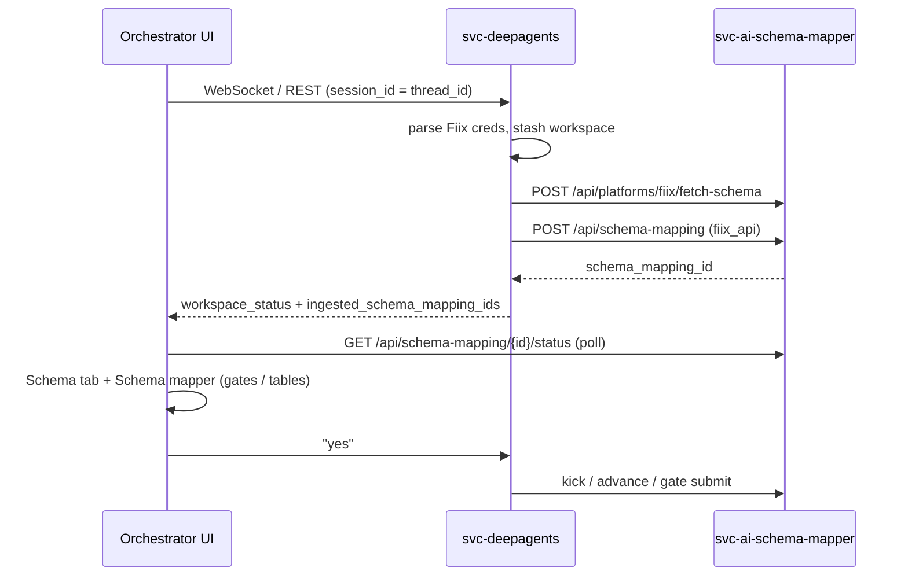

# Fiix Schema Mapping + Deep Agent Orchestrator — Final Change Log

**Date:** 2026-06-02  
**Scope:** End-to-end Fiix live schema → plenum_cafm mapping in the **Deep Agent Orchestrator** chat, with the same gate UI as standalone **Schema Mapper** and parity with **Migration** (CSV/Excel) right-rail pattern.

---

## 1. Goals delivered

| Goal | Status |
|------|--------|
| Fiix credentials in chat → test → fetch → start 8-node schema pipeline | Done |
| Session context preserved (credentials, mapping id, “yes” after gates) | Done |
| **Schema** tab / center **Schema mapper** view (tables, gates, polling) | Done |
| Fiix source counts (88 objects / 275 fields) match chat in UI | Done (fetch summary persisted on job + status enrich) |
| Stuck `ingest` 0% — kick pipeline on “yes” | Done (`POST .../kick`) |
| WebSocket chat opens schema rail (was REST-only) | Done |
| TypeScript build (`schema-comparison-banner`) | Fixed |

---

## 2. Architecture (high level)



**Metric clarity (common confusion):**

| Metric | Meaning |
|--------|---------|
| **88** Fiix object types | `tables_by_object` keys from live Fiix API (not Postgres table count) |
| **275** Fiix fields | Column count across those objects |
| **137 / 1306** | `plenum_cafm` target DB (`information_schema`) |
| Center pills **Ingestion / Mapping / Hierarchy** | Generic **workspace** status only — **not** the schema mapper UI |

---

## 3. Backend — `svc-deepagents`

### 3.1 New modules

| File | Purpose |
|------|---------|
| `src/agents/fiix_agent.py` | Tools: `configure_fiix_credentials`, `test_fiix_connection`, `fetch_fiix_schema`, `start_fiix_schema_mapping`, `get_schema_mapping_status`, Fiix ingestion helpers |
| `src/agents/fiix_credential_parse.py` | Parse pasted lines (`Subdomain:`, `App Key:`, etc.) from chat |
| `src/agents/schema_mapper_agent.py` | `continue_schema_mapping_gate` — advance step, submit gates (approve-all), **kick** stalled pipeline |
| `src/agents/session_workspace.py` | Per-session state: Fiix creds, `schema_mapping_ids`, `active_schema_mapping_id`, conversation turns, `workflow_stream_completion_payload` |
| `src/agents/single_door_flow.py` | Single-door routing helpers (related orchestration) |
| `tests/test_phase_d.py` | Credential parse, session context, Fiix/schema tests |

### 3.2 Modified — orchestration

| File | Changes |
|------|---------|
| `src/agents/orchestrator.py` | Fiix credential merge at `run_stateful`; auto test/fetch/start when creds complete; schema gate shortcuts on “yes”; `set_session_context(session_id)`; WebSocket stream includes `tool_calls`, `workspace_status`, `ingested_schema_mapping_ids`; stable `thread_id` = `session_id` |
| `src/agents/system_prompt.py` | Fiix flow + Schema tab guidance for agents |
| `src/api/routes/workflow.py` | `WorkspaceStatusResponse`: `active_schema_mapping_id`, `schema_mapping_ids`, `ingested_schema_mapping_ids`; extract ids from tool outputs |
| `src/config.py` | `migration_base_url` → schema-mapper service |

### 3.3 Key behaviors

- **`continue_schema_mapping_gate`**: On `ingest`/`running` with low progress → `POST /api/schema-mapping/{id}/kick`; on `step_paused` → `/advance`; on `awaiting_review` → gate POST with UI-default bodies.
- **Status copy**: Uses `current_node` for step hint (not last node in `nodes[]` array).
- **Chat vs UI counts**: Chat uses `display_summary` from fetch; UI uses `/status` → now enriched via job `final_summary` + `total_tables`/`total_fields`.

---

## 4. Backend — `svc-ai-schema-mapper`

### 4.1 New / updated connectors

| File | Purpose |
|------|---------|
| `src/connectors/fiix_credentials.py` | Credential resolution, `summarize_fiix_mapper`, `build_schema_comparison`, `enrich_schema_comparison_for_status`, `schema_comparison_from_nodes` |
| `src/connectors/fiix_plenum_mappings.py` | Plenum column mappings for Fiix objects (static + expansion) |
| `src/connectors/fiix_connector.py` | **88** `ALL_OBJECTS`; `tables_by_object` includes id-only objects; `FindRequest` samples |

### 4.2 `src/app.py` (highlights)

| Area | Change |
|------|--------|
| `POST /api/schema-mapping` (Fiix) | After fetch: store `total_tables`, `total_fields`, `final_summary.schema_comparison` on job |
| `GET .../status` | Returns `schema_comparison` via `enrich_schema_comparison_for_status()` |
| **`POST /api/schema-mapping/{id}/kick`** | Resume/restart stalled graph when status is `ingest`/`running` (not `step_paused` / `awaiting_review`) |
| `POST /api/platforms/fiix/fetch-schema` | Returns `mapper`, `summary`, `schema_comparison`, `display_summary` |

### 4.3 Pipeline nodes (touched in this effort)

| File | Notes |
|------|-------|
| `src/graph/nodes/fiix_preprocess_node.py` | Fiix-specific preprocess in schema graph |
| `src/graph/nodes/schema_deterministic_node.py` | Deterministic mapping step |
| `src/graph/nodes/schema_ingest_node.py` | Node 1 — populates `table_count` / `total_columns` in step payload |
| `src/graph/schema_state.py` | State fields for Fiix path |

---

## 5. Frontend

### 5.1 New files

| File | Purpose |
|------|---------|
| `pipeline/deep-agent/deep-agent-schema-panel.tsx` | Right-rail schema panel (mirrors `deep-agent-migration-panel`): emerald header, polling, `SchemaContent` |
| `pipeline/deep-agent/deep-agent-workspace-status.tsx` | Ingestion/Mapping/Hierarchy pills + clickable **Schema mapper** pill |
| `pipeline/schema/schema-comparison-banner.tsx` | Fiix vs plenum side-by-side cards; resolves counts from API, stats, nodes, step payload |

### 5.2 Modified — orchestrator

| File | Changes |
|------|---------|
| `deep-agent-orchestrator-shell.tsx` | Wider grid for schema/migration rail; **Schema** right tab; center **Chat \| Schema mapper** tabs; inline `DeepAgentSchemaPanel` in center |
| `use-deep-agent-orchestrator.ts` | `schemaContext` + localStorage persistence; hydrate UUID from chat turns; workspace poll 3s; WebSocket `workflow_completed` → `applySchemaContext`; tool_completed hooks for schema tools |
| `deep-agents-api.ts` | `extractIngestedSchemaMappingIds`, `extractSchemaMappingIdsFromText`; WebSocket event fields; `WorkspaceStatus` schema fields |

### 5.3 Modified — schema pipeline UI

| File | Changes |
|------|---------|
| `schema-content.tsx` | `embeddedRail`, `drivePipelineSteps`, `showCompletedHistory`; auto-`/advance` in rail; emerald running state |
| `schema-gate-state.ts` | `isSchemaStepPauseBlockingFieldMapping`, `shouldOrchestratorAutoAdvanceSchemaStep` |
| `schema-step-pause.tsx` | `embeddedRail`; `Step1Ingest` / `SchemaTablesTree` for Fiix tables; emerald Continue button |

### 5.4 UX map

| Location | What user sees |
|----------|----------------|
| Center header pills | Workspace only (not schema tables) |
| Center **Schema mapper** tab | Full pipeline UI (comparison banner, canonical, ingest trees, gates) |
| Right **Schema** tab | Same content as migration-style rail |
| Chat | `display_summary` markdown (88/275 vs 137/1306) |

---

## 6. API reference (schema mapper)

| Method | Path | Notes |
|--------|------|-------|
| POST | `/api/platforms/fiix/fetch-schema` | Live Fiix mapper + comparison |
| POST | `/api/schema-mapping` | Start job (`connector_type: fiix`) |
| GET | `/api/schema-mapping/{id}/status` | Poll; includes `schema_comparison`, `nodes`, gates |
| POST | `/api/schema-mapping/{id}/advance` | After `step_paused` |
| POST | `/api/schema-mapping/{id}/kick` | Stalled `ingest`/`running` |
| POST | `/api/schema-mapping/{id}/gate/pre-semantic` | HITL |
| POST | `/api/schema-mapping/{id}/gate/field-mapping` | HITL |
| POST | `/api/schema-mapping/{id}/gate/hierarchy` | HITL |
| POST | `/api/schema-mapping/{id}/gate/artifacts-review` | HITL |

## 7. API reference (deep agents)

| Method | Path | Notes |
|--------|------|-------|
| POST | `/api/workflow/run` | REST orchestrator |
| WS | `/api/workflow/ws/{session_id}` | Streaming; completion includes schema ids |
| GET | `/api/workflow/workspace/{session_id}` | `active_schema_mapping_id`, `schema_mapping_ids` |

---

## 8. Issues fixed (this iteration)

| Symptom | Root cause | Fix |
|---------|------------|-----|
| No **Schema** tab | WebSocket never set `schemaContext`; session switch cleared state | `applySchemaContext` on WS complete; persist + parse UUID from turns |
| Center shows 0 Fiix tables | `/status` built comparison before node 1; chat used fetch summary | Persist fetch on job; `enrich_schema_comparison_for_status`; frontend `stats` fallback |
| “Yes” at ingest 0% useless | No kick/advance for `ingest` | `POST /kick` + agent calls it |
| Wrong “Last node: Write to Database” | Used last entry in `nodes[]` | Use `current_node` |
| Build error `table_count` on gate payload | Typed union gate payload | Cast via `unknown` + `isRecord` |

---

## 9. Deploy / verify

```bash
# From repo root
docker compose -f docker-compose.single-url.local.yml up --build
```

1. Hard-refresh browser (or new orchestrator session).
2. Paste Fiix credentials → wait for schema mapping id in chat.
3. Confirm **Schema** right tab and center **Schema mapper** show **88 / 275** (new jobs after deploy).
4. Reply **yes** — pipeline should kick past `ingest` if stalled.
5. For jobs created **before** persist fix: start a **new** mapping or wait for node 1 ingest to finish.

**Env:** `svc-deepagents` must reach schema mapper (`migration_base_url` / nginx route to `svc-ai-schema-mapper`).

---

## 10. File inventory (this feature set)

### Backend — deepagents (new)

```
svc-deepagents/src/agents/fiix_agent.py
svc-deepagents/src/agents/fiix_credential_parse.py
svc-deepagents/src/agents/schema_mapper_agent.py
svc-deepagents/src/agents/session_workspace.py
svc-deepagents/tests/test_phase_d.py
```

### Backend — deepagents (modified)

```
svc-deepagents/src/agents/orchestrator.py
svc-deepagents/src/agents/system_prompt.py
svc-deepagents/src/api/routes/workflow.py
svc-deepagents/src/config.py
```

### Backend — schema-mapper (new)

```
svc-ai-schema-mapper/src/connectors/fiix_credentials.py
svc-ai-schema-mapper/src/connectors/fiix_plenum_mappings.py
```

### Backend — schema-mapper (modified)

```
svc-ai-schema-mapper/src/app.py
svc-ai-schema-mapper/src/connectors/fiix_connector.py
svc-ai-schema-mapper/src/graph/nodes/fiix_preprocess_node.py
svc-ai-schema-mapper/src/graph/nodes/schema_deterministic_node.py
svc-ai-schema-mapper/src/graph/nodes/schema_ingest_node.py
```

### Frontend (new)

```
apps/frontend/src/features/ai/pipeline/deep-agent/deep-agent-schema-panel.tsx
apps/frontend/src/features/ai/pipeline/deep-agent/deep-agent-workspace-status.tsx
apps/frontend/src/features/ai/pipeline/schema/schema-comparison-banner.tsx
```

### Frontend (modified)

```
apps/frontend/src/features/ai/deep-agents-api.ts
apps/frontend/src/features/ai/pipeline/deep-agent/deep-agent-orchestrator-shell.tsx
apps/frontend/src/features/ai/pipeline/deep-agent/use-deep-agent-orchestrator.ts
apps/frontend/src/features/ai/pipeline/schema/schema-content.tsx
apps/frontend/src/features/ai/pipeline/schema/schema-gate-state.ts
apps/frontend/src/features/ai/pipeline/schema/schema-step-pause.tsx
```

---

## 11. Related docs (repo)

- `svc-deepagents/src/docs/DEEPAGENT_FLOW.md` — orchestrator flow
- `svc-deepagents/PHASES_1_7_COMPLETION.md` — phase checklist
- `svc-ai-schema-mapper/PHASE_8_COMPLETION_REPORT.md` — schema mapper phases

---

## 12. Security note

Fiix credentials pasted in chat are **session-scoped** in deepagents workspace memory only. Do **not** commit `.env` files with live keys. Rotate keys if they were shared in logs or chat exports.
