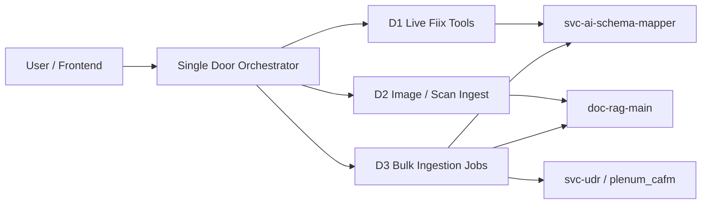

# Phase D — Scale & Source Expansion Plan

**Status:** D1 + D2 + D3 implemented  
**Prerequisites:** Phases A–C complete (see [Completion baseline](#completion-baseline-phases-abc))  
**Gateway base (local):** `http://127.0.0.1:3000/backend/deep-agents`  
**Owner service:** `svc-deepagents` (canonical single door)

---

## Product goals addressed

| Vision item | Phase D deliverable |
|-------------|---------------------|
| Big historical loads (5+ years, mixed formats) | **D3** — batch ingestion jobs, pagination, workspace batch registry |
| Offline scans / visual | **D2** — image + scan extensions in single-door + Doc RAG |
| Live CMMS (Fiix) | **D1** — orchestrator tools wrapping schema-mapper Fiix APIs |
| ERP / other CMMS | **D1** (Fiix first); **D3** generic batch path reusable for Maximo/SAP file exports |

---

## Completion baseline (Phases A–C)

| Phase | Scope | Key files |
|-------|--------|-----------|
| **A** | Single-door upload + UDR ingest prerequisite | `single_door_flow.py`, `workflow.py` (`run-stateful-with-files`), `orchestrator.py`, frontend deep-agent shell |
| **B** | Hybrid UDR tools (CRUD + SQL + reads) | `udr_agent.py`, `system_prompt.py`, `orchestrator.py` |
| **C** | WO semantic clarification (confirm → `prepare_intelligent_work_order`) | `orchestrator.py`, `system_prompt.py` |

Phase D extends ingestion **breadth** (sources + formats) and **depth** (volume + job orchestration), without replacing the single-door contract from Phase A.

---

## Phase D overview



**Recommended implementation order:** D1 → D2 → D3 (D1 is smallest integration surface; D3 depends on batch registry introduced in D1/D2).

---

## D1 — Live Fiix via orchestrator

### Goal

Expose **live Fiix CMMS pull** from chat and single-door flows. Today Fiix exists only under `svc-ai-schema-mapper` (`FiixSchemaConnector`, `POST /api/fiix-ingestion`, `GET /api/platforms/fiix/*`). Deepagents only sees Fiix via **file upload** + `cmms_name="Fiix"`.

### Files to add / update

| File | Action |
|------|--------|
| `src/agents/fiix_agent.py` | **Add** — `@tool` wrappers: `test_fiix_connection`, `fetch_fiix_schema`, `start_fiix_ingestion`, `get_fiix_ingestion_status`, `list_fiix_ingestions` |
| `src/agents/orchestrator.py` | Register Fiix tools; session keys `fiix_ingestion_id`, `fiix_last_status` |
| `src/agents/system_prompt.py` | Route intents: `fiix_sync`, `fiix_test_connection`; prerequisite: schema mapping job optional but document when target schema is `plenum_cafm` |
| `src/agents/single_door_flow.py` | Optional: if message contains `source=fiix` / `pull from fiix`, run Fiix ingestion before/instead of file loop |
| `src/config.py` | Pass-through flags: `fiix_enabled` (read-only hint for orchestrator messages; credentials stay in schema-mapper) |
| `src/api/routes/workflow.py` | Extend `run-stateful-with-files` Form field: `ingest_source` = `files` \| `fiix` (default `files`) |
| `apps/frontend/src/features/ai/deep-agents-api.ts` | Optional `ingestSource`, `schemaMappingId` on upload API |
| `apps/frontend/src/features/ai/pipeline/deep-agent/deep-agent-orchestrator-shell.tsx` | “Sync from Fiix” action + status poll UI |

### Downstream APIs (already in schema-mapper — do not duplicate logic)

| Method | Path | Purpose |
|--------|------|---------|
| GET | `/api/platforms/fiix/test-connection` | Credential check |
| GET | `/api/platforms/fiix/fetch-schema` | Schema preview |
| POST | `/api/fiix-ingestion` | Start background ingestion (`organization_id`, `schema_mapping_id`) |
| GET | `/api/fiix-ingestion/{id}` | Poll `status`, `progress_pct`, stats |
| GET | `/api/fiix-ingestion` | List recent jobs |

HTTP base: `settings.migration_base_url` (schema-mapper host).

### Implementation notes

1. **`start_fiix_ingestion` tool** — POST with query/body params; return `ingestion_id`; set session `ingested_documents=true` equivalent flag: `ingested_sources` append `{type:"fiix", id}`.
2. **Polling** — `get_fiix_ingestion_status` with exponential backoff guidance in tool docstring; orchestrator should not block chat >30s — return “job running, ask for status”.
3. **UDR prerequisite** — Treat successful Fiix ingestion start **or** file single-door as satisfying “ingestion happened” (update `_has_ingestion` in `orchestrator.py`).
4. **Security** — Never return Fiix secrets in tool output; surface only subdomain + connected/not connected.
5. **Link to migration** — If user uploaded Fiix export CSV **and** asks live sync, prefer live API when `fiix_enabled`; else fall back to file migration.

### Why

Closes the gap between “Fiix in schema-mapper” and “Fiix in single door,” enabling CMMS-as-source without manual export files.

---

## D2 — Image / scan extensions

### Goal

Support **standalone** visual ingest: offline scans (`.pdf` already), plus `.png`, `.jpg`, `.jpeg`, `.tiff`, `.tif`, `.webp`. Scanned PDFs continue through existing Doc RAG PDF pipeline (vision + OCR normalization in `doc-rag-main`).

### Files to add / update

| File | Action |
|------|--------|
| `src/agents/single_door_flow.py` | Extend `DOCUMENT_EXTS`; route images to `index_document` with `document_type` hint `scan` / `image` |
| `src/agents/doc_rag_agent.py` | Map extensions; ensure upload MIME matches doc-rag accept list; keep `_INDEX_TIMEOUT=180` for large scans |
| `doc-rag-main/app/routers/documents.py` | Confirm `UploadFile` content-type allowlist includes `image/*` (add if missing) |
| `doc-rag-main/app/services/extraction_service.py` | Image-only extraction path (single-page vision) if not already unified with PDF page pipeline |
| `apps/frontend/.../deep-agent-orchestrator-shell.tsx` | `accept` attribute: add image extensions |
| `apps/frontend/.../deep-agents-api.ts` | Client-side extension validation aligned with backend |

### Implementation notes

1. **Classification** — In `run_single_door_ingestion_sequence`, images use same branch as documents (not structured migration).
2. **Metadata** — Pass `document_type="scan"` when extension ∈ `{.tif, .tiff}` or filename matches `*scan*`.
3. **OCR** — Reuse `text_normalization.py` OCR fixes on extracted text chunks (no new OCR engine in deepagents).
4. **Size limits** — Config `deep_agents_max_upload_mb` (new, default 50) checked in `workflow.py` before save.

### Why

Matches “offline scans” and “visual” in the product vision without requiring users to wrap scans in PDF.

---

## D3 — Bulk ingestion jobs

### Goal

Orchestrate **large, multi-file / multi-year** loads: job queue, per-file status, resumable batches, higher UDR read limits for batch agents — not one sequential loop blocking the HTTP request.

### Files to add / update

| File | Action |
|------|--------|
| `src/models/ingest_batch.py` | **Add** — SQLAlchemy model: `id`, `session_id`, `organization_id`, `status`, `total_files`, `completed`, `failed`, `metadata_json`, timestamps |
| `src/services/ingest_batch_service.py` | **Add** — create batch, append file results, mark complete |
| `src/workers/ingest_batch_worker.py` | **Add** — asyncio background processor (or ARQ task delegating to schema-mapper ARQ for Fiix) |
| `src/api/routes/ingest_batch.py` | **Add** — `POST /api/ingest/batches`, `GET /api/ingest/batches/{id}`, `POST /api/ingest/batches/{id}/cancel` |
| `src/agents/single_door_flow.py` | Refactor: `enqueue_batch(files)` instead of inline await for N>3 files |
| `src/api/routes/workflow.py` | `run-stateful-with-files`: if `len(files)>batch_inline_threshold` (default 3), return `batch_id` immediately + summary |
| `src/agents/orchestrator.py` | Tools: `get_ingest_batch_status`, `list_session_batches`; session `active_batch_id` |
| `src/agents/udr_agent.py` | Add `udr_read_records_paginated(offset, limit)` with cap 500; document Mode 3 filesystem for >500 |
| `svc-udr` (optional) | Server-side cursor if deepagents direct SQL is insufficient |
| `apps/frontend/...` | Batch progress component (poll `GET /api/ingest/batches/{id}`) |

### Batch state machine

```
pending → running → completed | failed | cancelled
```

Per-file substates: `queued | migrating | indexing | done | error`.

### Implementation notes

1. **Inline vs async** — ≤3 files: keep current synchronous `run_single_door_ingestion_sequence` (Phase A behavior). >3: create batch, return 202-style payload in workflow response (`batch_id`, `poll_url`).
2. **Concurrency** — Worker pool size config `ingest_batch_concurrency` (default 4); respect doc-rag extraction semaphore (do not exceed doc-rag capacity).
3. **Fiix in batch** — Batch item type `fiix_sync` calls D1 tools from worker.
4. **Session registry** — `ingested_documents` true when batch `completed` with `failed < total` OR any file succeeded.
5. **Retention** — Temp upload cleanup via existing `remove_files`; batch metadata retained 7 days (config).

### Why

Addresses “5+ years / many files” without 90s+ HTTP timeouts and provides operability (progress, retry failed files).

---

## Cross-cutting changes (all of D1–D3)

| File | Change |
|------|--------|
| `src/agents/system_prompt.py` | New route intents; bulk job instructions; Fiix sync wording |
| `src/docs/DEEPAGENT_FLOW.md` | Link Phase D; update tool count |
| `.env.example` | `INGEST_BATCH_INLINE_THRESHOLD`, `INGEST_BATCH_CONCURRENCY`, `DEEP_AGENTS_MAX_UPLOAD_MB` |
| `pyproject.toml` | Alembic migration dep if batch table in deepagents DB (same Postgres as checkpointer) |

---

## Smoke tests

Run with stack up (`docker compose -f docker-compose.single-url.local.yml up`).  
Gateway prefix: `G=http://127.0.0.1:3000/backend/deep-agents`

### Preflight (all sub-phases)

```powershell
$G = "http://127.0.0.1:3000/backend/deep-agents"
curl -sS "$G/health"
curl -sS "http://127.0.0.1:3000/backend/schema-mapper/health"
curl -sS "http://127.0.0.1:3000/backend/doc-rag/health"
```

| # | Test | Pass criteria |
|---|------|----------------|
| P1 | Deepagents health | `status: ok` |
| P2 | Schema-mapper health | `status: ok` |
| P3 | Doc-rag health | `status: ok` |

---

### D1 smoke — Live Fiix

**Requires:** `FIIX_*` env vars on schema-mapper (+ ARQ worker for full completion).

```powershell
$G = "http://127.0.0.1:3000/backend/deep-agents"
$body = '{"message":"Test Fiix connection and tell me if CMMS is reachable","session_id":"phase-d-fiix-001"}'
curl -sS -m 60 -X POST "$G/api/workflow/run-stateful" -H "Content-Type: application/json" --data-raw $body
```

```powershell
$body = '{"message":"Start a full Fiix data sync into plenum_cafm and give me the ingestion job id","session_id":"phase-d-fiix-002","organization_id":"00000000-0000-0000-0000-000000000001"}'
curl -sS -m 90 -X POST "$G/api/workflow/run-stateful" -H "Content-Type: application/json" --data-raw $body
```

```powershell
# After ingestion_id returned:
$body = '{"message":"What is the status of Fiix ingestion JOB_ID_HERE?","session_id":"phase-d-fiix-002"}'
curl -sS -m 40 -X POST "$G/api/workflow/run-stateful" -H "Content-Type: application/json" --data-raw $body
```

```powershell
# UDR gate should pass after Fiix sync started/completed (same session)
$body = '{"message":"run udr mapping and hierarchy now","session_id":"phase-d-fiix-002"}'
curl -sS -m 40 -X POST "$G/api/workflow/run-stateful" -H "Content-Type: application/json" --data-raw $body
```

| # | Test | Pass criteria |
|---|------|----------------|
| D1.1 | Connection test via chat | Tool `test_fiix_connection` in `tool_calls`; no secrets in answer |
| D1.2 | Start ingestion | `ingestion_id` UUID; `start_fiix_ingestion` in tool_calls |
| D1.3 | Poll status | Progress or terminal status from schema-mapper |
| D1.4 | UDR after Fiix | No “upload files first” block when ingestion satisfied |
| D1.5 | Direct API (optional) | `POST http://127.0.0.1:3000/backend/schema-mapper/api/fiix-ingestion` returns 202 |

---

### D2 smoke — Images / scans

**Fixtures:** add `apps/frontend/src/features/ai/api-response-snapshots/_inputs/demo_scan_page.png` (or any small PNG).

```powershell
$G = "http://127.0.0.1:3000/backend/deep-agents"
curl -sS -m 120 -X POST "$G/api/workflow/run-stateful-with-files" `
  -F "message=Index this equipment scan" `
  -F "session_id=phase-d-image-001" `
  -F "files=@PATH_TO/demo_scan_page.png"
```

```powershell
# Mixed: CSV + PNG + PDF
curl -sS -m 180 -X POST "$G/api/workflow/run-stateful-with-files" `
  -F "message=Ingest all attachments" `
  -F "session_id=phase-d-image-002" `
  -F "files=@.../demo_structured_assets.csv" `
  -F "files=@.../demo_scan_page.png" `
  -F "files=@.../demo_unstructured_maintenance_report_jan2024.pdf"
```

| # | Test | Pass criteria |
|---|------|----------------|
| D2.1 | PNG only | Not in `Skipped unsupported files`; `index_document` success |
| D2.2 | TIFF (optional) | Same as D2.1 if fixture available |
| D2.3 | Mixed batch | CSV → migration tools; PNG/PDF → index; summary lists all three |
| D2.4 | Scanned PDF | Existing PDF path still works (regression) |

---

### D3 smoke — Bulk jobs

**Fixtures:** 5+ small files (mix CSV + PDF) under `_inputs/`.

```powershell
$G = "http://127.0.0.1:3000/backend/deep-agents"
# 5 files — should return batch_id without hanging >30s on HTTP layer
curl -sS -m 45 -X POST "$G/api/workflow/run-stateful-with-files" `
  -F "message=Ingest historical maintenance archive" `
  -F "session_id=phase-d-bulk-001" `
  -F "files=@file1.csv" -F "files=@file2.csv" -F "files=@file3.pdf" `
  -F "files=@file4.pdf" -F "files=@file5.pdf"
```

```powershell
curl -sS "$G/api/ingest/batches/BATCH_ID_FROM_ABOVE"
```

```powershell
$body = '{"message":"Show ingest batch status for this workspace","session_id":"phase-d-bulk-001"}'
curl -sS -m 40 -X POST "$G/api/workflow/run-stateful" -H "Content-Type: application/json" --data-raw $body
```

**Burst regression (from Phase A fixes):**

```powershell
# 30 concurrent small PDFs — expect 30/30 indexed OR explicit batch queue (not 20/min hard fail)
# Script: reuse burst30 pattern from repo root burst30_results.jsonl methodology
```

| # | Test | Pass criteria |
|---|------|----------------|
| D3.1 | Large upload HTTP | Response within 45s with `batch_id` |
| D3.2 | Batch GET | `completed + failed == total_files` when done |
| D3.3 | Chat status tool | `get_ingest_batch_status` returns per-file breakdown |
| D3.4 | UDR after batch | Mapping/hierarchy allowed when batch `completed` with ≥1 success |
| D3.5 | UDR pagination | `udr_read_records` with `offset=100, limit=100` returns second page |
| D3.6 | Burst 30 | ≥28/30 success (same bar as Phase A burst30b) |

---

## Unit / integration tests (pytest)

| Module | Tests |
|--------|--------|
| `tests/test_fiix_agent.py` | Mock schema-mapper HTTP; assert tool shapes and error handling |
| `tests/test_single_door_images.py` | Extension routing for `.png`, unknown ext skipped |
| `tests/test_ingest_batch_service.py` | State transitions, per-file error isolation |
| `tests/test_orchestrator_fiix_prereq.py` | Fiix ingestion satisfies UDR gate |

---

## Risks & dependencies

| Risk | Mitigation |
|------|------------|
| Fiix ingestion requires ARQ + Redis on schema-mapper | Document in `.env.example`; smoke test skips D1.2 if worker down |
| Doc-rag overload on image burst | Keep semaphore; batch worker throttles concurrency |
| Duplicate orchestration with schema-mapper UI | Fiix tools are thin HTTP wrappers only |
| deepagents DB migration for batch table | Single Alembic revision; use same `DB_URL` as checkpointer |
| Rate limits on `run-stateful-with-files` | Batch endpoint returns early; worker unaffected by 120/min cap |

---

## Definition of done (Phase D)

- [x] **D1** — Five Fiix tools registered; chat can test, start, and poll ingestion; UDR gate accepts Fiix sync
- [x] **D2** — `.png`/`.jpg`/`.jpeg`/`.webp`/`.tif`/`.tiff` in single-door; frontend accept list updated; doc-rag image extraction
- [x] **D3** — Batch API + worker; >3 files async; status in chat; UDR read limit 500/offset
- [ ] All smoke tables D1.*–D3.* green in CI or documented manual run log
- [ ] `DEEPAGENT_FLOW.md` roadmap links here

---

## Effort estimate

| Sub-phase | Effort | Notes |
|-----------|--------|-------|
| D1 Live Fiix | **M** (2–3 days) | Mostly wiring + session state |
| D2 Images | **S** (1 day) | Extension + doc-rag allowlist |
| D3 Bulk jobs | **L** (4–6 days) | Model, worker, API, frontend progress |

**Total:** ~1.5–2 sprints for one developer, assuming schema-mapper Fiix worker already operational.

---

## Out of scope (Phase E+)

- Generic live ERP connectors (SAP, Oracle) — file export + `cmms_name` only until adapter framework
- Object storage connectors (Azure Blob / Tencent COS) as ingestion sources
- Fine-tuned routing model / voice interface

See `src/docs/DEEPAGENT_FLOW.md` §15 for longer-term roadmap.
