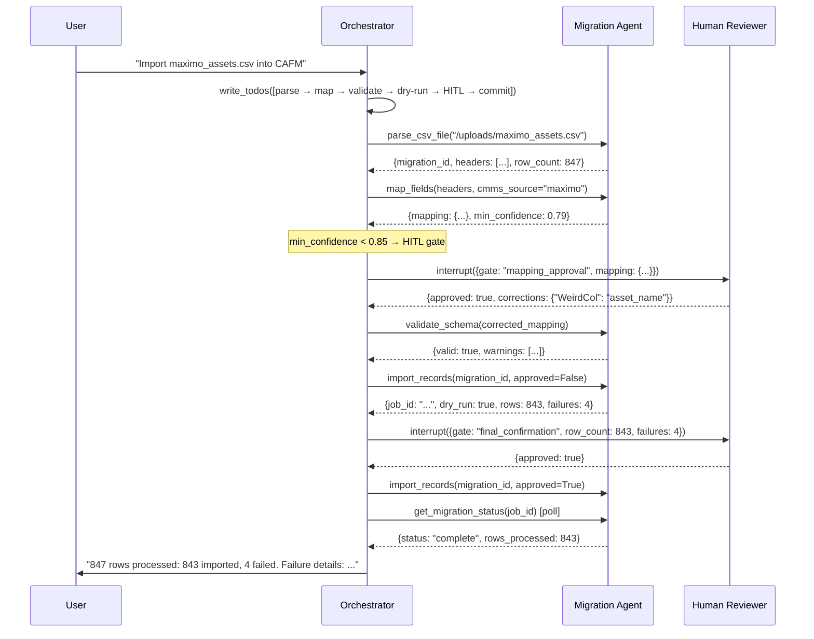

# 🤖 Plenum CAFM — DeepAgent Flow Documentation


> **Definitive technical reference for the Plenum CAFM DeepAgent orchestration layer.**
> Covers all 6 tool groups, 46 tools, orchestration patterns, API contracts, and deployment.

---

## 📋 Table of Contents

1. [Executive Summary](#1-executive-summary)
2. [System Architecture](#2-system-architecture)
3. [DeepAgent Core Concepts](#3-deepagent-core-concepts)
4. [Tool Groups — 46 Tools](#4-tool-groups--46-tools)
5. [Orchestration Flows](#5-orchestration-flows)
6. [System Prompt Engineering](#6-system-prompt-engineering)
7. [Code Implementation](#7-code-implementation)
8. [Database Schema](#8-database-schema)
9. [API Contracts](#9-api-contracts)
10. [Examples & Use Cases](#10-examples--use-cases)
11. [Performance & Monitoring](#11-performance--monitoring)
12. [Deployment](#12-deployment)
13. [Troubleshooting](#13-troubleshooting)
14. [Best Practices](#14-best-practices)
15. [Roadmap & Extensions](#15-roadmap--extensions)
16. [Appendix](#16-appendix)

---

# 1. Executive Summary

## What is the Plenum CAFM DeepAgent?

The Plenum CAFM DeepAgent is the top-level AI orchestration layer for a Computer-Aided
Facilities Management platform serving facilities operations across the UAE. It is the
central intelligence hub that routes natural language maintenance requests across five
specialized agent domains and 40 domain tools (46 including meta).

It is **not a chatbot**. It is a planning and execution engine built on:

- **LangGraph `create_react_agent`** — stateful ReAct loop with tool calling
- **OpenAI `gpt-4o-mini`** — main orchestrator model (temperature=0 for determinism)
- **46 `@tool` functions** — 6 meta-capability tools + 40 domain tools spanning work orders,
  compliance, data migration, document RAG, and direct database access
- **4-mode orchestration strategy** — Direct, Planned, Filesystem Offload, Parallel
- **Shared HTTP client** — tenacity retry (3×, exponential backoff) + per-service circuit breaker
- **HITL gates** — LangGraph `interrupt()` + Postgres checkpointer for irreversible operations
- **WebSocket streaming** — real-time `astream_events` with typed events per tool call

## Business Value

| Metric | Without DeepAgent | With DeepAgent |
|--------|------------------|----------------|
| Code to route a complex multi-domain request | ~300 lines of branching logic | System prompt + tool registry |
| New tool onboarding | Rewrite router + handlers | Add one `@tool` function |
| Context management for large datasets | Manual state tracking | `write_file()` / `read_file()` |
| Parallel workstreams | Async boilerplate | Parallel `task()` spawning |
| Maintenance request → work order | Multi-service manual chaining | Single `create_intelligent_work_order()` call |

## Key Capabilities

- **Planning** — `write_todos()` forces explicit step-by-step reasoning before any tool call
- **Subagent spawning** — `task(agent, prompt)` delegates focused work to domain specialists
- **Filesystem offload** — `write_file()` / `read_file()` prevents context window overflow
- **Memory** — session-scoped state preserves user context across multi-turn conversations
- **HITL** — human approval gates via LangGraph `interrupt()` for irreversible operations

## Production Readiness

- ✅ Stateless per request — horizontal scaling ready
- ✅ All tool calls logged with structured output
- ✅ Two-gate SQL injection protection (regex + parameterised queries)
- ✅ Graceful error returns — tools never raise uncaught exceptions to the orchestrator
- ✅ Async throughout — no blocking I/O
- ✅ Configurable via environment variables — no hardcoded secrets

---

# 2. System Architecture

## 2.1 High-Level Architecture

```
┌─────────────────────────────────────────────────────────────────────────┐
│                         EXTERNAL CLIENTS                                │
│   Frontend (React) · Mobile App · API consumers · Automated triggers    │
└────────────────────────────┬────────────────────────────────────────────┘
                             │ HTTP POST /api/workflow/run
                             ▼
┌─────────────────────────────────────────────────────────────────────────┐
│                    FastAPI Gateway  (port 8008)                         │
│                                                                         │
│   POST /api/workflow/run  ─────────────────┐                            │
│   POST /api/migration/*   (direct bypass)  │                            │
│   GET  /health                             │                            │
└────────────────────────────────────────────┼────────────────────────────┘
                                             │
                                             ▼
┌─────────────────────────────────────────────────────────────────────────┐
│               DeepAgent Orchestrator  (gpt-4o-mini, temp=0)                 │
│                                                                         │
│   ┌─────────────────────────────────────────────────────────────────┐  │
│   │            LangGraph ReAct Agent Loop                           │  │
│   │                                                                 │  │
│   │   SystemMessage (build_system_prompt)                           │  │
│   │   HumanMessage (user request)                                   │  │
│   │         ↓                                                       │  │
│   │   [Reason] → choose tool → [Execute] → [Observe] → [Reason]    │  │
│   │         ↓ (terminal)                                            │  │
│   │   AIMessage (final answer)                                      │  │
│   └─────────────────────────────────────────────────────────────────┘  │
└──────┬───────────┬───────────┬───────────┬───────────┬─────────────────┘
       │           │           │           │           │
       ▼           ▼           ▼           ▼           ▼
┌──────────┐ ┌──────────┐ ┌──────────┐ ┌──────────┐ ┌──────────┐
│   UDR    │ │    WO    │ │Migration │ │ Doc RAG  │ │Compliance│
│  Agent   │ │  Engine  │ │  Agent   │ │  Agent   │ │  Agent   │
│ 2 tools  │ │  Agent   │ │ 6 tools  │ │ 6 tools  │ │ 2 tools  │
│          │ │ 21 tools │ │          │ │          │ │          │
└────┬─────┘ └────┬─────┘ └────┬─────┘ └────┬─────┘ └────┬─────┘
     │            │            │            │            │
     ▼            ▼            ▼            ▼            ▼
┌──────────────────────────────────────────────────────────────────────┐
│                     DOWNSTREAM SERVICES                              │
│                                                                      │
│  PostgreSQL (Azure) ──── Direct async queries (UDR + Compliance)    │
│  svc-work-order-management (:8007) ──── WO intelligent pipeline     │
│  svc-ai-schema-mapper (:8003) ──── Migration + field mapping        │
│  doc-rag-main (:8004) ──── Document indexing + vector search        │
│  OpenAI API ──── gpt-4o-mini orchestration                               │
│  Anthropic API ──── Claude Haiku (intelligence steps inside WO svc) │
└──────────────────────────────────────────────────────────────────────┘
```

## 2.2 Component Breakdown

| Component | Technology | Purpose | Port |
|-----------|-----------|---------|------|
| API Gateway | FastAPI + uvicorn | HTTP entry point, lifespan management, CORS | 8008 |
| Orchestrator | LangGraph `create_react_agent` + gpt-4o-mini | ReAct loop, tool dispatch, answer synthesis, streaming | — |
| Meta Tools | Python ContextVar + _TaskRunner | Planning, subagent spawning, file offload, session memory | — |
| HTTP Client | httpx + tenacity + circuit breaker | Shared retry/CB for all 3 HTTP-backed agent domains | — |
| HITL Checkpointer | AsyncPostgresSaver (langgraph-checkpoint-postgres) | State persistence for interrupt/resume flows | DB:5432 |
| UDR Agent | SQLAlchemy 2.0 + asyncpg | Direct DB reads — users, any table | DB:5432 |
| WO Engine Agent | http_client → svc-work-order-management | 15-step AI WO pipeline + CRUD + reference lookups | 8007 |
| Migration Agent | http_client → svc-ai-schema-mapper | CSV/Excel CMMS migration + HITL field mapping gates | 8003 |
| Doc RAG Agent | http_client → doc-rag-main | Document indexing + pgvector semantic search | 8004 |
| Compliance Agent | SQLAlchemy 2.0 + asyncpg | PM adherence + compliance reporting | DB:5432 |
| PostgreSQL | Azure PostgreSQL 15 | All CAFM data — schema: `plenum_cafm` | 5432 |

## 2.3 Technology Stack

| Layer | Technology | Version | Notes |
|-------|-----------|---------|-------|
| Language | Python | 3.12 | Async throughout |
| Web framework | FastAPI | ≥0.115 | + uvicorn[standard] |
| AI orchestration | LangGraph | ≥0.2 | `create_react_agent` |
| LLM — orchestrator | OpenAI gpt-4o-mini | latest | temperature=0 |
| LLM — WO intelligence | Claude Haiku 4.5 | latest | Inside svc-work-order-management |
| Tool framework | LangChain Core | ≥0.3 | `@tool` decorator |
| HTTP client | httpx | ≥0.27 | Async, 45s timeout |
| ORM | SQLAlchemy | ≥2.0 | Async session |
| DB driver | asyncpg | ≥0.29 | Direct for UDR + Compliance |
| Validation | Pydantic v2 | ≥2.7 | + pydantic-settings |
| Logging | structlog | ≥24.0 | JSON in prod, colour in debug |
| Secrets | Environment variables | — | pydantic-settings with AliasChoices |

---

# 3. DeepAgent Core Concepts

## 3.1 The ReAct Loop

The orchestrator runs a **Reason → Act → Observe** loop until it has a complete answer:

```
SystemMessage ─────────────────────────────────────────────────┐
HumanMessage  ─────────────────────────────────────────────────┤
                                                               ▼
                                                    ┌──────────────────┐
                                                    │  gpt-4o-mini REASONS  │
                                                    │  "I need to call │
                                                    │  list_work_orders│
                                                    │  with priority=  │
                                                    │  urgent"         │
                                                    └────────┬─────────┘
                                                             │ tool_call
                                                             ▼
                                                    ┌──────────────────┐
                                                    │  TOOL EXECUTES   │
                                                    │  list_work_orders│
                                                    │  → [{...}, ...]  │
                                                    └────────┬─────────┘
                                                             │ ToolMessage
                                                             ▼
                                                    ┌──────────────────┐
                                                    │  gpt-4o-mini OBSERVES │
                                                    │  "Got 4 urgent   │
                                                    │  WOs. Now I need │
                                                    │  compliance data"│
                                                    └────────┬─────────┘
                                                             │ tool_call
                                                             ▼
                                                    ┌──────────────────┐
                                                    │ check_requirements│
                                                    │  → {compliant:.. }│
                                                    └────────┬─────────┘
                                                             │ ToolMessage
                                                             ▼
                                                    ┌──────────────────┐
                                                    │  gpt-4o-mini DECIDES  │
                                                    │  "Enough data.   │
                                                    │  Synthesise."    │
                                                    └────────┬─────────┘
                                                             │ AIMessage (final)
                                                             ▼
                                                    ┌──────────────────┐
                                                    │  RETURN TO USER  │
                                                    └──────────────────┘
```

## 3.2 The 4 Orchestration Strategies

The system prompt teaches the orchestrator to choose the right strategy for every request.

### Strategy 1 — Direct (Simple, single-domain)

**When:** ≤ 2 tool calls, one domain, clear answer.

**Never use:** `write_todos` or `task()`.

```python
# User: "What's the status of WO-20240115143022?"
→ get_work_order("WO-20240115143022")
→ Return: status=active, priority=high, asset=MOB-AHU-001, vendor=TechServ MEP
```

### Strategy 2 — Planned + Subagents (Complex, multi-domain)

**When:** ≥ 2 domains, sequential reasoning, output of step A feeds step B.

**Always:** `write_todos()` first, then `task()` for each domain piece.

```python
# User: "Which assets are at risk — consider PM status, open WOs, and compliance"
write_todos([
    "Step 1: Get all assets from UDR",
    "Step 2: Get overdue PPM schedules from WO Engine",
    "Step 3: Get urgent/critical open WOs from WO Engine",
    "Step 4: Run portfolio compliance report",
    "Step 5: Cross-join by asset, score risk, return top 10"
])

task("udr", "Query the assets table. Return asset_code, asset_name, category, location_code.")
task("wo_engine", "Get all PPM schedules with overdue_only=true.")
task("wo_engine", "List all open WOs with priority urgent or critical.")
task("compliance", "Generate compliance report for scope=all_assets.")
# Synthesise → risk-ranked list
```

### Strategy 3 — Filesystem Offload (Large context)

**When:** Tool returns 50+ records, or building a multi-part report incrementally.

```python
# User: "Full asset health report — every asset, WO history, PM status, compliance"
task("udr", "Query assets table. Return all columns.")
write_file("report/assets.json", assets_result)

task("wo_engine", "List all work orders — all statuses.")
write_file("report/wo_all.json", wo_result)

task("wo_engine", "Get all PPM schedules.")
write_file("report/ppm.json", ppm_result)

task("compliance", "Generate compliance report for scope=all_assets.")
write_file("report/compliance.json", compliance_result)

# Later: read and join only what's needed for the final output
data = read_file("report/assets.json")
```

### Strategy 4 — Parallel Spawning (Independent workstreams)

**When:** Multiple tasks with zero dependency between them.

**Fire all `task()` calls in the same turn — they run concurrently.**

```python
# User: "Morning operations briefing"
write_todos([
    "Step 1 (parallel): Open urgent WOs | Today's PPM | Zero-stock parts | Compliance rate",
    "Step 2: Synthesise into structured briefing"
])

# All four fire in the same turn:
task("wo_engine", "List open WOs with priority urgent or critical.")
task("wo_engine", "Get PPM schedules due today 2026-05-13.")
task("udr", "Query spare_parts where stock_on_hand = 0.")
task("compliance", "Generate compliance report for scope=all_assets.")
# Wait → synthesise
```

## 3.3 Meta-Capability Tools (6 tools — `src/agents/meta_tools.py`)

These 6 tools are registered first in `ALL_TOOLS` and are available to the main orchestrator.
They are implemented in-process (no HTTP) and are session-isolated via Python `ContextVar`.

### `write_todos(todos: list[str])`

Forces explicit planning before execution. Visible to the user as a reasoning trace.
Use for any task with ≥ 3 steps or ≥ 2 domains.

### `task(agent: str, prompt: str) → str`

Spawns a focused subagent from a named domain. Available agents:
`migration` | `doc_rag` | `wo_engine` | `compliance` | `udr`

Each subagent is a `create_react_agent` instance with only its domain's tools and no
checkpointer. Returns a result string. HITL gates are bypassed inside `task()` — use
`/run-stateful` at the top level for HITL-sensitive flows.

### `write_file(path: str, content: str)` and `read_file(path: str) → str`

Filesystem offload for large datasets. Files are written under a session-scoped temp
directory — no two sessions share the same file namespace. Use `write_file` when a
tool returns more data than can be kept in the active context. Use `read_file` later.

### `memory_set(key: str, value: str)` and `memory_get(key: str) → str`

Session-scoped key/value store. Persist the user's site, role, and session preferences
so subsequent turns don't need to repeat lookups.

```python
memory_set("active_site", "Dubai Marina Tower B")
memory_set("last_asset", "MOB-AHU-003")

site = memory_get("active_site")  # → "Dubai Marina Tower B"
```

## 3.4 HITL (Human-in-the-Loop) Gates

For irreversible or high-impact operations, the orchestrator uses `interrupt()` to pause
execution and wait for human confirmation before proceeding.

**Three standard HITL gates in the Plenum platform:**

| Gate | Trigger | What human sees | Resume action |
|------|---------|----------------|---------------|
| **Migration Mapping** | `map_fields()` returns confidence < 0.85 on any column | Field mapping with confidence scores, suggested alternatives | Approve / correct / reject |
| **Bulk Destructive** | Close/transition of > 10 WOs in one request | List of WOs to be affected, action, notes | Confirm / cancel |
| **Final Migration Commit** | `import_records(approved=False)` dry-run passes | Row count, failure count, sample rows | Approve commit / rollback |

```python
# HITL pattern in tool flow
result = await map_fields(headers, cmms_source="maximo")
if result["min_confidence"] < 0.85:
    # Pause — wait for human to review and correct the mapping
    human_input = interrupt({
        "gate": "mapping_approval",
        "mapping": result["mapping"],
        "low_confidence_fields": result["low_confidence_fields"],
    })
    # Resume with corrected mapping
    result["mapping"].update(human_input["corrections"])
```

> **⚠️ Note:** `interrupt()` is a LangGraph primitive. The API response for a request
> that hits a gate returns `{"status": "pending_human_review", "gate": "...", "session_id": "..."}`.
> The frontend must call `POST /api/workflow/resume/{session_id}` with the human decision to continue.

---

# 4. Tool Groups — 46 Tools

## 4.0 Meta-Capability Tools (6 tools)

See Section 3.3 for full details. These are the 6 orchestration primitives that make
the domain tools composable. They are always listed first in `ALL_TOOLS`.

| Tool | Description |
|------|-------------|
| `write_todos(todos)` | Record an explicit step-by-step plan before execution |
| `task(agent, prompt)` | Spawn a focused subagent for one domain |
| `write_file(path, content)` | Offload large data to session-scoped temp storage |
| `read_file(path)` | Retrieve previously offloaded session data |
| `memory_set(key, value)` | Persist a session-scoped key/value pair |
| `memory_get(key)` | Retrieve a persisted session value |

---

## 4.1 UDR Agent — Universal Database Reader (2 tools)

**Purpose:** Direct read access to any table in the `plenum_cafm` PostgreSQL schema.
The fallback layer when no domain-specific tool covers the needed data.

**Implementation:** Direct async SQLAlchemy queries via `AsyncSessionLocal`.
Two-gate security: regex validation + parameterised queries. No ORM writes — read only.

**Security model:**
```python
_SAFE_IDENT = re.compile(r"^[a-z_][a-z0-9_]{0,63}$")  # Gate 1: regex
# Gate 2: all filter values passed as SQLAlchemy text() named params — never interpolated
```

---

### `lookup_user(user_id: str) → dict`

**Description:** Resolve a user UUID to their full profile including roles.

**Parameters:**
| Parameter | Type | Description |
|-----------|------|-------------|
| `user_id` | `str` | UUID of the user to look up |

**Returns:**
```json
{
  "user_id": "a3f2...",
  "full_name": "Ahmed Al Mansouri",
  "email": "ahmed@plenum-tech.com",
  "department": "Facilities",
  "phone": "+971 50 123 4567",
  "roles": ["technician", "approver"]
}
```

**When to use:** Before assigning a work order technician; when a request references a
user by ID; to verify role-based permissions before an operation.

**Example:**
```python
result = await lookup_user("a3f2c1d4-8b9e-4a2f-b1c3-d5e6f7a8b9c0")
# → {"full_name": "Ahmed Al Mansouri", "roles": ["technician"]}
```

**Error handling:** Returns `{"error": "User not found"}` if UUID does not exist.
Returns `{"error": "..."}` on DB failure — never raises.

---

### `query_table(table_name: str, filters: dict[str, Any] | None = None) → list[dict]`

**Description:** SELECT from any `plenum_cafm` table with optional equality filters.
Hard cap of 100 rows. All values parameterised.

**Parameters:**
| Parameter | Type | Description |
|-----------|------|-------------|
| `table_name` | `str` | Table name — must match `^[a-z_][a-z0-9_]{0,63}$` |
| `filters` | `dict \| None` | Equality filters — `{column_name: value}` |

**Returns:** List of row dicts, at most 100 rows.

**When to use:** Any structured lookup not covered by domain-specific tools. Especially
useful for: `spare_parts` (stock levels), `locations`, `asset_categories`, `inspections`,
`vendors`, `technicians`.

**Example:**
```python
# Zero-stock parts
rows = await query_table("spare_parts", {"stock_on_hand": 0})
# → [{"part_code": "MOTOR-8HP", "stock_on_hand": 0, "minimum_allowed_stock": 2}, ...]

# All locations
locs = await query_table("locations")
# → [{"location_code": "MOB-L2", "location_name": "Level 2 Plant Room"}, ...]
```

**Error handling:** Returns `[{"error": "Invalid table name"}]` if regex fails.
Returns `[{"error": "..."}]` on DB failure.

> **⚠️ Never** pass user-provided strings as `table_name` without prior validation.
> The orchestrator is instructed to validate table names before calling this tool.

---

## 4.2 WO Engine Agent — Work Order Lifecycle (21 tools)

**Purpose:** Complete work order management — dynamic multi-step approval, intelligent
AI-powered creation, CRUD operations, status transitions, and reference data lookups.

**Implementation:** HTTP calls to `svc-work-order-management` (port 8007).
Timeout: 45 seconds (intelligent pipeline can take ~20s for the full 15-step assessment).

### Dynamic approval tools (5)

After a work order is created, the engine auto-suggests approvers from rules + similar historical
WOs (`auto_suggestion`, `previous_approval_processes`). Create tools return this inline; use
`suggest_approval_chain` only for preview-without-create or to refresh an existing WO.

| Tool | HTTP | Description |
|------|------|-------------|
| `suggest_approval_chain(...)` | `POST /api/work-orders/suggest-approval` | Optional preview / refresh; pass `work_order_id` after create |
| `request_approval_chain(work_order_id, approval_type)` | `POST /api/work-orders/{id}/request-approval` | Persist multi-step chain; notify step 1 |
| `get_approval_chain(work_order_id)` | `GET /api/work-orders/{id}/approval-chain` | All steps with status and `request_id` |
| `customize_approval_chain(work_order_id, chain)` | `PATCH /api/work-orders/{id}/customize-chain` | Override pending steps `[{step, email}]` |
| `respond_to_approval_step(approval_request_id, approved, notes)` | `POST /api/work-orders/approvals/{id}/respond` | Approve/reject one step; unblocks next |

**Mandatory WO creation flow:**

```
create_intelligent_work_order (or create_work_order)
  → present auto_suggestion from create result → user confirms chain
  → request_approval_chain
```

**Example `suggest_approval_chain` response (abbreviated):**

```json
{
  "confidence": "high",
  "match_score": 87,
  "risk_score": 45,
  "chain": [
    {"step": 1, "name": "Khalid Al Rashid", "email": "khalid@facility.ae", "role": "Facility Manager"},
    {"step": 2, "name": "Ops Director", "email": "ops@facility.ae", "role": "Director"}
  ],
  "auto_suggestion": {
    "message": "Suggested approval chain (auto-generated):\nKhalid Al Rashid (Facility Manager) → Ops Director (Director)\n...",
    "recommended_chain_summary": "Khalid Al Rashid (Facility Manager) → Ops Director (Director)"
  },
  "previous_approval_processes": [
    {
      "work_order_id": "WO-20260101120000",
      "match_score": 82,
      "chain_summary": "Khalid Al Rashid (Facility Manager) → Ops Director (Director)",
      "final_status": "completed",
      "total_approval_hours": 18
    }
  ]
}
```

> **DB:** Requires Alembic migration `005_dynamic_approval_engine` on `svc-work-order-management`
> and populated `plenum_cafm.users` / `roles` for approver resolution.

### Intelligent Pipeline Tools

These three tools go through `POST /api/chat/` on svc-work-order-management, which
triggers the WOOrchestrator — a full 15-step AI assessment covering criticality scoring,
safety analysis, compliance detection, asset intelligence, vendor scoring, smart scheduling,
resource allocation, workspace pinning, and journey log creation.

---

### `create_intelligent_work_order(...) → dict`

**Description:** **Primary work order creation tool.** Runs the complete 15-step AI
assessment pipeline. Always prefer this over `create_work_order` for user-submitted requests.

**Parameters:**
| Parameter | Type | Default | Description |
|-----------|------|---------|-------------|
| `source` | `str` | required | `email \| ppm \| manual \| tenant \| internal \| remediation` |
| `asset` | `str` | required | Asset name or code (e.g. `MOB-AHU-001`) |
| `location` | `str` | required | Building/zone where asset is located |
| `issue_description` | `str` | required | Clear description of the fault or task |
| `priority` | `str` | `"medium"` | `low \| medium \| high \| urgent \| critical` |
| `request_type` | `str` | `"repair"` | `repair \| maintenance \| inspection \| installation` |
| `requester_name` | `str` | `"System"` | Full name of person raising the request |
| `requester_email` | `str` | `"system@..."` | Email address of requester |
| `requester_phone` | `str \| None` | `None` | Phone number (optional) |
| `session_id` | `str \| None` | `None` | Continue an existing chat session |

**Returns:**
```json
{
  "session_id": "abc-123",
  "reply": "Work order WO-20260513142201 created successfully...",
  "work_order": {
    "work_order_id": "WO-20260513142201123456",
    "status": "pending_approval",
    "priority": "high",
    "asset": "MOB-AHU-001",
    "location": "Level 2 Plant Room",
    "vendor": "TechServ MEP",
    "scheduled_date": "2026-05-15",
    "journey_log_id": "jl-789"
  }
}
```

**15-step pipeline (runs inside svc-work-order-management):**
```
Step  1: Source identification — assign source type, generate WO reference
Step  2: Collect workspace data — org context, site config, active sessions
Step  3: Assess criticality — Claude Haiku scores urgency (1-10)
Step  4: Identify safety conditions — PPE, permits, hazardous material flags
Step  5: Detect compliance requirements — regulatory checks for asset type
Step  6: Validate location — verify location accessibility and clearance
Step  7: Asset intelligence lookup — maintenance history, failure patterns
Step  8: Site clearance check — active permits, access restrictions
Step  9: Warranty intelligence — warranty status, recommended parts, duration
Step 10: Check spare parts availability — stock levels for likely parts
Step 11: Vendor scoring — rank available vendors by suitability
Step 12: Resource allocation — recommended technician skill profile
Step 13: Smart scheduling — optimal time slot based on criticality + availability
Step 14: Workspace pin creation — trackable PIN for the WO
Step 15: Journey log creation — SLA clock starts, milestone sequence initialised
```

**Example:**
```python
result = await create_intelligent_work_order(
    source="manual",
    asset="MOB-AHU-001",
    location="Level 2 Plant Room",
    issue_description="Unusual grinding noise from fan motor, vibration increasing",
    priority="high",
    request_type="repair",
    requester_name="Khalid Al Rashid",
    requester_email="khalid@facility.ae",
)
```

---

### `trigger_ppm_work_order(...) → dict`

**Description:** Trigger a Planned Preventive Maintenance schedule through the AI agent.
The agent assesses the asset, runs scheduling and resource tools, and creates the WO.

**Parameters:**
| Parameter | Type | Description |
|-----------|------|-------------|
| `schedule_id` | `str` | UUID of the PPM schedule |
| `asset_id` | `str` | Asset UUID or asset_code |
| `asset_name` | `str` | Human-readable asset name |
| `description` | `str` | Description of the maintenance task |
| `maintenance_type` | `str \| None` | e.g. `"quarterly_service"` |
| `next_due_date` | `str \| None` | ISO date `YYYY-MM-DD` |
| `frequency` | `str \| None` | e.g. `"monthly"`, `"quarterly"` |

**Returns:** Same `ChatResponse` structure as `create_intelligent_work_order`.

**Example:**
```python
result = await trigger_ppm_work_order(
    schedule_id="sch-uuid-abc",
    asset_id="MOB-AHU-001",
    asset_name="AHU Level 2",
    description="Quarterly filter replacement and belt inspection",
    maintenance_type="quarterly_service",
    next_due_date="2026-05-15",
    frequency="quarterly",
)
```

---

### `process_email_work_order(...) → dict`

**Description:** Process an incoming maintenance request email into a work order.
The AI agent extracts details, looks up the asset, and creates the WO.

**Parameters:**
| Parameter | Type | Description |
|-----------|------|-------------|
| `subject` | `str \| None` | Email subject line |
| `body` | `str \| None` | Full email body text |
| `sender_name` | `str \| None` | Name of the sender |
| `sender_email` | `str \| None` | Email address of the sender |
| `asset` | `str \| None` | Asset name/code if known |
| `location` | `str \| None` | Location if known |

**Example:**
```python
result = await process_email_work_order(
    subject="Urgent: AC not cooling in Server Room",
    body="Hi, the AC unit on Floor 3 server room has stopped cooling...",
    sender_name="IT Manager",
    sender_email="it@company.ae",
)
```

---

### CRUD + Lifecycle Tools

---

### `create_work_order(...) → dict`

**Description:** Create a work order directly without the AI assessment pipeline.
Use for migrations, programmatic bulk creation, or when assessment is not needed.

**Parameters:**
| Parameter | Type | Default | Description |
|-----------|------|---------|-------------|
| `source` | `str` | required | Origin of the request |
| `asset` | `str` | required | Asset name or code |
| `location` | `str` | required | Location of the asset |
| `issue_description` | `str` | required | Description of the fault |
| `requester_name` | `str` | required | Full name of requester |
| `requester_email` | `str` | required | Email of requester |
| `priority` | `str` | `"medium"` | `low \| medium \| high \| urgent \| critical` |
| `request_type` | `str` | `"repair"` | `repair \| maintenance \| inspection \| installation` |
| `requester_phone` | `str \| None` | `None` | Phone number |

**Returns:** `WorkOrderResponse` with `work_order_id`, `status`, all fields.

---

### `get_work_order(work_order_id: str) → dict`

**Description:** Fetch full details of a single work order.

**Returns:**
```json
{
  "work_order_id": "WO-20260513142201123456",
  "source": "manual",
  "status": "active",
  "priority": "high",
  "asset": "MOB-AHU-001",
  "location": "Level 2 Plant Room",
  "issue_description": "Grinding noise from fan motor",
  "request_type": "repair",
  "requester_name": "Khalid Al Rashid",
  "requester_email": "khalid@facility.ae",
  "vendor": "TechServ MEP",
  "scheduled_date": "2026-05-15",
  "scheduled_time": "09:00",
  "cmms_work_order_id": null,
  "journey_log_id": "jl-789",
  "created_at": "2026-05-13T14:22:01Z"
}
```

---

### `update_work_order(work_order_id: str, **kwargs) → dict`

**Description:** Update editable fields on an existing WO. Does **not** change status.

**Editable fields:** `vendor`, `scheduled_date`, `scheduled_time`, `estimated_duration`,
`inspection_required`, `special_requirements`, `cmms_work_order_id`

**Example:**
```python
result = await update_work_order(
    "WO-20260513142201123456",
    vendor="AlBaraka Facilities",
    scheduled_date="2026-05-16",
    estimated_duration=3.5,
)
```

---

### `list_work_orders(...) → list[dict]`

**Description:** List work orders with optional filters. Returns paginated summaries.

**Parameters:**
| Parameter | Type | Default | Description |
|-----------|------|---------|-------------|
| `status` | `str \| None` | `None` | Filter by status |
| `priority` | `str \| None` | `None` | Filter by priority |
| `source` | `str \| None` | `None` | Filter by source |
| `asset` | `str \| None` | `None` | Partial match on asset name/code |
| `from_date` | `str \| None` | `None` | Start date (ISO `YYYY-MM-DD`) |
| `to_date` | `str \| None` | `None` | End date (ISO `YYYY-MM-DD`) |
| `page` | `int` | `1` | Page number |
| `limit` | `int` | `50` | Records per page (max 200) |

**Status values:** `pending_approval | preparing | prepared | active | completed | closed`

---

### `transition_work_order(work_order_id: str, new_status: str, notes: str | None) → dict`

**Description:** Move a work order through the state machine.

**Valid transitions:**
```
pending_approval ──→ preparing
pending_approval ──→ closed
preparing        ──→ prepared
preparing        ──→ closed
prepared         ──→ active
prepared         ──→ preparing
prepared         ──→ closed
active           ──→ completed
active           ──→ closed
completed        ──→ closed
```

---

### `approve_work_order(work_order_id: str) → dict`

**Description:** Approve a WO in `pending_approval` status → transitions to `preparing`.

---

### `close_work_order(work_order_id: str, notes: str | None) → dict`

**Description:** Close a WO from any open status. Terminal — cannot be reopened.

---

### `get_work_order_history(work_order_id: str) → list[dict]`

**Description:** Chronological status change log with timestamps, actor notes, and milestones.

---

### Reference Lookup Tools

---

### `search_assets(query: str, limit: int = 20) → list[dict]`

**Description:** Search assets by name, code, category, or description. Always use this
before raising a WO to confirm the correct asset identifier.

**Example:**
```python
assets = await search_assets("AHU Level 2")
# → [{"asset_code": "MOB-AHU-002", "asset_name": "AHU Level 2", "category": "Air Handler", ...}]
```

---

### `get_asset_details(asset_id: str) → dict`

**Description:** Full asset record including category, make, model, serial, installation date,
warranty status, and current open WO count.

---

### `search_locations(query: str | None = None) → list[dict]`

**Description:** List all facility locations or search by name. Use to find the correct
location value before creating a WO.

---

### `find_ppm_schedules(asset_id: str | None, overdue_only: bool = False) → list[dict]`

**Description:** Retrieve PPM schedules, optionally filtered by asset or overdue status.

**Example:**
```python
overdue = await find_ppm_schedules(overdue_only=True)
# → [{"schedule_id": "...", "asset_id": "MOB-AHU-001", "next_due_date": "2026-04-01", ...}]
```

---

### `get_dashboard_stats() → dict`

**Description:** Aggregate work order statistics for the current state of operations.

**Returns:**
```json
{
  "total_open": 17,
  "by_status": {"pending_approval": 3, "active": 9, "preparing": 5},
  "by_priority": {"critical": 2, "urgent": 4, "high": 6, "medium": 5},
  "overdue_count": 3,
  "assets_with_open_wos": 11
}
```

---

## 4.3 Migration Agent (6 tools)

**Purpose:** End-to-end CMMS data migration — parse incoming CSV/Excel from Maximo,
SAP PM, Fiix, or any source; map fields to canonical CAFM schema; validate; import.

**Implementation:** HTTP calls to `svc-ai-schema-mapper` (port 8003).

**Intended sequence:**
```
parse_csv_file → map_fields → validate_schema → import_records (approved=False, dry-run)
                                                      ↓ [HITL: human reviews mapping]
                                         import_records (approved=True, commit)
                                                      ↓
                                         get_migration_status (poll until complete)
                                                      ↓ (on error)
                                         rollback_migration
```

---

### `parse_csv_file(file_path: str, encoding: str = "latin1") → dict`

**Description:** Read headers and a 50-row sample from a CSV or Excel file.
Used as the first step to inspect the source data before mapping.

**Parameters:**
| Parameter | Type | Default | Description |
|-----------|------|---------|-------------|
| `file_path` | `str` | required | Server path or uploaded file path |
| `encoding` | `str` | `"latin1"` | File encoding — client files typically latin1 |

**Returns:**
```json
{
  "migration_id": "mig-uuid-abc",
  "headers": ["Asset Code", "Asset Name", "Work Order Priority", "SM Code"],
  "row_count": 500,
  "sample_rows": [{"Asset Code": "MOB-001", "Asset Name": "AHU-1", ...}],
  "detected_encoding": "latin1"
}
```

**When to use:** Always first. Provides the `migration_id` and headers needed for `map_fields`.

---

### `map_fields(source_headers: list[str], cmms_source: str) → dict`

**Description:** AI-map raw column headers from a source CMMS to canonical CAFM field names.
Uses the AI Schema Mapper's 4-tier mapping strategy (exact → alias → regex → Haiku constrained).

**Parameters:**
| Parameter | Type | Description |
|-----------|------|-------------|
| `source_headers` | `list[str]` | Headers from `parse_csv_file` |
| `cmms_source` | `str` | Source system name: `"maximo"`, `"fiix"`, `"sap_pm"`, `"generic"` |

**Returns:**
```json
{
  "mapping": {
    "Asset Code": {"canonical": "asset_code", "confidence": 0.99, "tier": 1},
    "Work Order Priority": {"canonical": "wo_priority", "confidence": 0.95, "tier": 1},
    "SM Code": {"canonical": "sm_code", "confidence": 0.92, "tier": 2},
    "WeirdColumn": {"canonical": null, "confidence": 0.0, "unresolved": true}
  },
  "min_confidence": 0.92,
  "unresolved_count": 1
}
```

> **Note:** If `min_confidence < 0.85`, trigger the **Migration Mapping HITL gate** before proceeding.

---

### `validate_schema(mapping: dict) → dict`

**Description:** Check the field mapping for type errors, missing required fields,
and columns that would violate database constraints.

**Returns:**
```json
{
  "valid": true,
  "errors": [],
  "warnings": ["'requester_phone' not mapped — will be null in DB"],
  "required_fields_present": ["asset_code", "wo_code", "priority"]
}
```

**When to use:** Always after `map_fields`, before `import_records`.
Never skip validation before a commit.

---

### `import_records(migration_id: str, approved: bool = False) → dict`

**Description:** Trigger the async import. `approved=False` runs a dry-run validation
only (safe to call multiple times). `approved=True` commits records to the database.

**Parameters:**
| Parameter | Type | Description |
|-----------|------|-------------|
| `migration_id` | `str` | From `parse_csv_file` result |
| `approved` | `bool` | `False` = dry-run \| `True` = commit |

**Returns:**
```json
{
  "job_id": "job-uuid-xyz",
  "status": "running",
  "estimated_rows": 500
}
```

Poll with `get_migration_status(job_id)` until `status == "complete"` or `"failed"`.

---

### `get_migration_status(migration_id: str) → dict`

**Description:** Poll the status of an in-progress migration job.

**Returns:**
```json
{
  "migration_id": "job-uuid-xyz",
  "status": "complete",
  "rows_processed": 498,
  "rows_failed": 2,
  "failure_details": [{"row": 47, "error": "invalid priority value 'URGENT'"}, ...],
  "elapsed_seconds": 12
}
```

---

### `rollback_migration(migration_id: str, reason: str) → dict`

**Description:** Delete all records written by a migration job. **Irreversible.**
Requires an explicit reason string. Always confirm with the user before calling.

> **⚠️ Warning:** `rollback_migration` permanently deletes data. The orchestrator is
> instructed never to call this without explicit user instruction.

---

## 4.4 Doc RAG Agent (6 tools)

**Purpose:** Document indexing, semantic search, and retrieval from the pgvector store.
Used for equipment manuals, SOPs, inspection reports, and any other documents.

**Implementation:** HTTP calls to `doc-rag-main` (port 8004).

---

### `index_document(file_path: str, document_type: str) → dict`

**Description:** Embed a PDF or DOCX into the pgvector store for future semantic search.
Claude Vision is used for PDF extraction (base64 inline or Files API).

**Parameters:**
| Parameter | Type | Description |
|-----------|------|-------------|
| `file_path` | `str` | Server path to the document |
| `document_type` | `str` | `"manual" \| "sop" \| "inspection" \| "invoice" \| "certificate"` |

**Returns:**
```json
{
  "document_id": "doc-uuid-abc",
  "chunks_created": 47,
  "pages_processed": 12,
  "status": "indexed"
}
```

---

### `query_docs(query: str, top_k: int = 5) → dict`

**Description:** Natural language Q&A grounded in indexed documents.
Claude synthesises an answer from the top-k retrieved chunks with source citations.

**Parameters:**
| Parameter | Type | Default | Description |
|-----------|------|---------|-------------|
| `query` | `str` | required | Natural language question |
| `top_k` | `int` | `5` | Number of chunks to retrieve before synthesis |

**Returns:**
```json
{
  "answer": "The belt tension for the AHU-001 fan motor should be adjusted to...",
  "sources": [
    {"document_id": "doc-abc", "page": 23, "chunk_text": "Belt tension specifications..."}
  ],
  "confidence": "high"
}
```

**When to use:** When the user asks a question whose answer lives in a document
(manual, SOP, inspection report). Do NOT use for structured data in the database.

---

### `semantic_search(query: str, filter_type: str | None = None) → list[dict]`

**Description:** Return raw matching chunks without synthesis. Use when you need all
relevant passages rather than a synthesised answer.

**Returns:** List of `{chunk_text, document_id, document_type, similarity_score}` dicts.

---

### `extract_text(file_path: str) → dict`

**Description:** One-off text extraction from a document without indexing it.
Use for documents you only need to read once (e.g. a vendor invoice for a single query).

**Returns:** `{"text": "...", "pages": 4, "extraction_method": "claude_vision"}`

---

### `get_document_metadata(document_id: str) → dict`

**Description:** Filename, type, page count, chunk count, and indexed_at timestamp.
Always check this before querying to confirm a document is properly indexed.

---

### `delete_document(document_id: str) → dict`

**Description:** Remove a document and all its chunks from the vector store.
**Irreversible.** Confirm with the user before calling.

> **⚠️ Warning:** The orchestrator is instructed never to call `delete_document`
> without explicit user confirmation that the document is no longer needed.

---

## 4.5 Compliance Agent (2 tools)

**Purpose:** Evaluate maintenance compliance against PM schedules, inspection outcomes,
and work order backlog. Used for audit readiness and regulatory reporting.

**Implementation:** Direct async SQLAlchemy queries via `AsyncSessionLocal`.

**Compliance logic:**

| Status | Criteria |
|--------|----------|
| `non_compliant` | Any overdue PM, OR a High-risk open corrective action from inspection |
| `at_risk` | Open urgent/critical WOs with no overdue PM |
| `compliant` | All PM schedules on time, no unclosed corrective actions |

---

### `check_requirements(asset_code: str, regulation: str | None = None) → dict`

**Description:** Per-asset compliance check — PM adherence, open corrective actions,
high-priority WO count.

**Parameters:**
| Parameter | Type | Description |
|-----------|------|-------------|
| `asset_code` | `str` | Asset identifier (e.g. `MOB-AHU-001`) |
| `regulation` | `str \| None` | Regulation filter — omit for all applicable regulations |

**Returns:**
```json
{
  "asset_code": "MOB-AHU-001",
  "compliance_status": "at_risk",
  "findings": [
    {"type": "open_critical_wo", "wo_id": "WO-20260513...", "age_days": 3},
    {"type": "pm_due_soon", "schedule_id": "sch-abc", "days_until_due": 5}
  ],
  "last_pm_date": "2026-02-15",
  "next_pm_due": "2026-05-15",
  "open_wo_count": 2
}
```

---

### `generate_compliance_report(scope: str, date_from: str | None = None, date_to: str | None = None) → dict`

**Description:** Portfolio-wide compliance summary. Scope is `"all_assets"` or a category
name (e.g. `"Air Handler"`, `"Boiler"`, `"Chiller"`).

**Returns:**
```json
{
  "scope": "all_assets",
  "total_assets": 60,
  "compliant": 41,
  "at_risk": 14,
  "non_compliant": 5,
  "compliance_rate_pct": 68.3,
  "non_compliant_assets": ["MOB-AHU-003", "MOB-CHW-001", ...],
  "generated_at": "2026-05-13T14:30:00Z"
}
```

---

# 5. Orchestration Flows

## 5.1 Simple Work Order Creation

```
User: "AHU on level 3 is making a grinding noise — raise an urgent WO"

→ Strategy: Mode 1 (Direct)

┌──────────────┐     ┌──────────────────┐     ┌──────────────────────────────┐
│  Orchestrator│────▶│  search_assets   │────▶│ MOB-AHU-003 found           │
│   (gpt-4o-mini)   │     │  query="AHU L3"  │     │ Location: Level 3 Plant Room │
└──────────────┘     └──────────────────┘     └──────────────┬───────────────┘
                                                              │
                                                              ▼
                                              ┌──────────────────────────────┐
                                              │ create_intelligent_work_order│
                                              │  source="manual"             │
                                              │  asset="MOB-AHU-003"         │
                                              │  location="Level 3 Plant Rm" │
                                              │  issue="grinding noise"      │
                                              │  priority="urgent"           │
                                              └──────────────┬───────────────┘
                                                              │
                                               ▼ POST /api/chat/ (svc-wo-mgmt)
                                              ┌──────────────────────────────┐
                                              │   15-STEP AI PIPELINE        │
                                              │   ~15-20 seconds             │
                                              │   criticality: 8/10          │
                                              │   vendor: TechServ MEP       │
                                              │   scheduled: 2026-05-14 09:00│
                                              └──────────────┬───────────────┘
                                                              │
                                                              ▼
                            ┌─────────────────────────────────────────────────┐
                            │ Response to user:                               │
                            │ "Work order WO-20260513142201 raised for        │
                            │  MOB-AHU-003 (Level 3 Plant Room). Classified  │
                            │  as urgent, TechServ MEP assigned, scheduled    │
                            │  for tomorrow 09:00. Journey log started."      │
                            └─────────────────────────────────────────────────┘

Expected time: ~20-25s end-to-end
Token usage: ~3,500 orchestrator + ~8,000 inside WO service pipeline
```

## 5.2 CSV Migration with HITL



## 5.3 Multi-Agent Morning Briefing

```
User: "Give me the morning operations briefing"
→ Strategy: Mode 4 (Parallel)

write_todos([
  "Step 1 (parallel): Open urgent/critical WOs | Today's overdue PPM | Zero-stock parts | Compliance rate",
  "Step 2: Synthesise into structured morning briefing"
])

┌─────────────────────┐  ┌─────────────────────┐  ┌─────────────────────┐  ┌─────────────────────┐
│   WO Engine Agent   │  │   WO Engine Agent   │  │     UDR Agent       │  │  Compliance Agent   │
│                     │  │                     │  │                     │  │                     │
│ list_work_orders(   │  │ find_ppm_schedules( │  │ query_table(        │  │ generate_compliance │
│   priority=urgent,  │  │   overdue_only=True)│  │   "spare_parts",    │  │   _report(          │
│   status=active)    │  │                     │  │   {stock_on_hand:0})│  │   scope="all_assets")
└─────────┬───────────┘  └─────────┬───────────┘  └─────────┬───────────┘  └─────────┬───────────┘
          │                        │                         │                         │
          └────────────────────────┴─────────────────────────┴─────────────────────────┘
                                                 │
                                                 ▼
                              ┌───────────────────────────────────────┐
                              │         Orchestrator synthesises       │
                              │                                       │
                              │  ## Morning Briefing — 13 May 2026    │
                              │                                       │
                              │  🔴 URGENT/CRITICAL WOs (6)           │
                              │  MOB-AHU-001: grinding noise (2d)    │
                              │  ...                                  │
                              │                                       │
                              │  📅 OVERDUE PPM (3)                   │
                              │  MOB-LIFT-001: quarterly service      │
                              │  ...                                  │
                              │                                       │
                              │  📦 ZERO STOCK PARTS (2)              │
                              │  MOTOR-8HP: 0 units (min: 2)          │
                              │  ...                                  │
                              │                                       │
                              │  ✅ COMPLIANCE: 68.3% (41/60 assets)  │
                              └───────────────────────────────────────┘
```

## 5.4 HITL Gate Flow

```
                    ┌──────────────────────────────┐
                    │  Orchestrator detects         │
                    │  condition requiring human    │
                    │  approval                     │
                    └──────────────┬───────────────┘
                                   │
                                   ▼ interrupt()
                    ┌──────────────────────────────┐
                    │  LangGraph PAUSES graph       │
                    │  State saved to checkpointer  │
                    │  (Postgres)                   │
                    └──────────────┬───────────────┘
                                   │
                    API returns immediately:
                    {
                      "status": "pending_human_review",
                      "gate": "mapping_approval",
                      "session_id": "abc-123",
                      "gate_data": { ... }
                    }
                                   │
                                   ▼
                    ┌──────────────────────────────┐
                    │  Frontend shows gate UI       │
                    │  User reviews, edits,         │
                    │  approves or rejects          │
                    └──────────────┬───────────────┘
                                   │
                    POST /api/workflow/resume/abc-123
                    { "approved": true, "corrections": {...} }
                                   │
                                   ▼
                    ┌──────────────────────────────┐
                    │  LangGraph RESUMES from       │
                    │  checkpoint with human input  │
                    │  Graph continues from where   │
                    │  it paused                    │
                    └──────────────────────────────┘
```

---

# 6. System Prompt Engineering

## 6.1 Master System Prompt Structure

The system prompt is generated by `build_system_prompt(extra_context)` in
[system_prompt.py](../agents/system_prompt.py). It has six sections:

```
# Identity
# Meta-Capability Tools (6)             (write_todos, task, write_file, read_file, memory_set, memory_get)
# Orchestration Strategy — 4 Modes      (with decision rules + examples)
# Agent Registry — 6 Groups, 38 Tools   (tables for each group)
# Output Format Rules                   (10 rules)
# Hard Rules — Never Violate These      (6 inviolable constraints)
```

## 6.2 Per-Agent Sub-Prompt Guidelines

The orchestrator doesn't switch system prompts per agent. Instead, the registry
section teaches it which tools belong to which domain. When it spawns `task()`,
the subagent inherits the same system prompt but with its domain's tools available.

**Key guidance per domain:**

| Agent | "When to use" trigger | "Don't use" guard |
|-------|----------------------|-------------------|
| UDR | Lookups not covered by domain tools | Don't use when a domain tool exists |
| WO Engine | Any WO, PPM, asset, or dashboard question | Don't use for document content questions |
| Migration | User wants to import CSV/Excel from another CMMS | Always sequence: parse→map→validate→import |
| Doc RAG | Question about document content | Don't use for structured DB data |
| Compliance | Audit readiness, PM adherence, regulatory status | Don't use for raw WO queries |

## 6.3 Runtime Context Injection

`build_system_prompt(extra_context)` appends per-request context after the base prompt:

```python
# In the workflow route, context can include:
extra_context = f"""
Active user: {user.full_name} ({user.role})
Active site: {site.name}
Session preferences: {session.prefs}
"""

system_prompt = build_system_prompt(extra_context)
```

This allows the orchestrator to scope its responses to the user's site and role
without modifying the base prompt template.

## 6.4 Output Format Rules (enforced by system prompt)

1. Lead with the answer — never open with tool narration
2. Summarise counts first, then detail
3. Show only relevant fields — never dump full DB rows
4. Never show raw UUIDs unless specifically requested
5. Format tables as markdown when presenting multiple records
6. Be explicit about data freshness
7. Errors must include suggested next steps
8. Multi-domain answers must label their sources
9. Never state an action was taken without calling the tool
10. Flag conflicting data from parallel tasks — don't silently pick one

---

# 7. Code Implementation

## 7.1 Project Structure

```
svc-deepagents/
├── Dockerfile
├── pyproject.toml                   ← tenacity>=8.3 added
├── .env.example
└── src/
    ├── __init__.py
    ├── config.py                    ← pydantic-settings — all env vars (incl. HITL_ENABLED)
    ├── database.py                  ← AsyncSessionLocal factory for UDR + Compliance
    ├── http_client.py               ← Shared async HTTP: tenacity retry + circuit breaker
    │
    ├── agents/
    │   ├── __init__.py
    │   ├── orchestrator.py          ← DeepAgentOrchestrator + ALL_TOOLS (38) + _TOOL_DOMAIN
    │   ├── system_prompt.py         ← SYSTEM_PROMPT + build_system_prompt()
    │   ├── meta_tools.py            ← 6 meta-capability tools + _TaskRunner + ContextVar
    │   ├── udr_agent.py             ← lookup_user, query_table
    │   ├── wo_engine_agent.py       ← 16 WO tools (uses http_client)
    │   ├── migration_agent.py       ← 6 migration tools (uses http_client, HITL gates)
    │   ├── doc_rag_agent.py         ← 6 doc RAG tools (uses http_client)
    │   └── compliance_agent.py      ← check_requirements, generate_compliance_report
    │
    ├── api/
    │   ├── __init__.py
    │   ├── main.py                  ← FastAPI app + lifespan (checkpointer init)
    │   ├── deps.py                  ← get_orchestrator() dependency
    │   └── routes/
    │       ├── __init__.py
    │       ├── health.py            ← GET /health
    │       ├── workflow.py          ← REST + WebSocket workflow endpoints
    │       └── migration.py         ← Direct migration endpoints (bypass LLM)
    │
    └── docs/
        ├── ARCHITECTURE.md
        ├── DEEPAGENT_FLOW.md        ← this file
        └── Claude_Code_Prompt_DeepAgent_MD.md
```

## 7.2 Orchestrator Implementation

```python
# src/agents/orchestrator.py

from collections.abc import AsyncGenerator
from langchain.chat_models import init_chat_model
from langchain_core.messages import HumanMessage, SystemMessage
from langgraph.errors import GraphInterrupt
from langgraph.prebuilt import create_react_agent
from langgraph.types import Command

from .meta_tools import init_meta_tools, set_session_context, write_todos, task, \
    write_file, read_file, memory_set, memory_get
from .system_prompt import build_system_prompt
# ... (all 32 domain tool imports)

ALL_TOOLS = [
    # Meta-capabilities (6) — always first
    write_todos, task, write_file, read_file, memory_set, memory_get,
    # UDR (2)
    lookup_user, query_table,
    # WO Engine — intelligent pipeline (3)
    create_intelligent_work_order, trigger_ppm_work_order, process_email_work_order,
    # WO Engine — CRUD + lifecycle (8)
    create_work_order, get_work_order, update_work_order, list_work_orders,
    transition_work_order, approve_work_order, close_work_order, get_work_order_history,
    # WO Engine — reference lookups (5)
    search_assets, get_asset_details, search_locations, find_ppm_schedules, get_dashboard_stats,
    # Migration (6)
    parse_csv_file, map_fields, validate_schema, import_records,
    get_migration_status, rollback_migration,
    # Doc RAG (6)
    index_document, query_docs, semantic_search, extract_text,
    get_document_metadata, delete_document,
    # Compliance (2)
    check_requirements, generate_compliance_report,
]  # Total: 38 tools

# Maps every tool name to its domain — drives agent_switch WebSocket events
_TOOL_DOMAIN: dict[str, str] = {
    "write_todos": "meta", "task": "meta", "write_file": "meta",
    "read_file": "meta", "memory_set": "meta", "memory_get": "meta",
    "lookup_user": "udr", "query_table": "udr",
    # ... (wo_engine: 16, migration: 6, doc_rag: 6, compliance: 2)
}


class DeepAgentOrchestrator:
    def __init__(
        self, openai_api_key: str, model: str = "gpt-4o-mini", checkpointer=None
    ) -> None:
        self._has_hitl = checkpointer is not None
        self._llm = init_chat_model(f"openai:{model}", temperature=0, api_key=openai_api_key)
        self._agent = create_react_agent(
            model=self._llm,
            tools=ALL_TOOLS,           # All 38 tools registered
            checkpointer=checkpointer, # AsyncPostgresSaver in HITL mode, None otherwise
        )
        init_meta_tools(openai_api_key, model)  # builds _TaskRunner with 5 sub-agents

    async def run(self, user_message, session_id, extra_context) -> dict:
        """Stateless — fresh thread_id per call, no state persisted."""
        set_session_context(thread_id)  # namespaces file/memory writes for this session
        result = await self._agent.ainvoke(input_, config)
        return {session_id, answer, tool_calls, success, interrupted, interrupt_payload}

    async def run_stateful(self, user_message, session_id, extra_context) -> dict:
        """HITL-capable — session_id is the LangGraph thread_id, state saved to Postgres."""
        # __interrupt__ in result means a gate fired → interrupted=True + interrupt_payload

    async def resume(self, session_id, decision) -> dict:
        """Feed human decision back into a paused graph via Command(resume=decision)."""
        return await self._invoke(Command(resume=decision), session_id, session_id)

    async def stream(
        self, user_message, session_id, extra_context
    ) -> AsyncGenerator[dict, None]:
        """Yield typed event dicts for WebSocket delivery using astream_events(version='v2')."""
        try:
            async for event in self._agent.astream_events(input_, config, version="v2"):
                if event["event"] == "on_tool_start":
                    # emit tool_started + agent_switch if domain changed
                    ...
                elif event["event"] == "on_tool_end":
                    # emit tool_completed
                    ...
                elif event["event"] == "on_chat_model_end" and not tool_calls:
                    final_answer = event["data"]["output"].content
        except GraphInterrupt as gi:
            yield {"type": "gate_interrupt", "payload": gi.args[0], "session_id": sid}
            return
        yield {"type": "workflow_completed", "answer": final_answer, "session_id": sid}

    async def get_thread_state(self, session_id) -> dict | None:
        """Read pending interrupt from Postgres checkpoint for /status endpoint."""
```

## 7.3 Tool Definition Pattern

Every `@tool` function follows this standard pattern:

```python
import httpx
import structlog
from langchain_core.tools import tool

from ..config import settings
from ..http_client import request as _request   # shared retry + circuit breaker

log = structlog.get_logger(__name__)
_TIMEOUT = 30.0
_SERVICE = "my_domain"  # used as circuit breaker key


def _err(exc: Exception, op: str) -> dict:
    if isinstance(exc, httpx.HTTPStatusError):
        log.error(f"{_SERVICE}.{op}.http_error", status=exc.response.status_code,
                  body=exc.response.text[:300])
        return {"error": exc.response.text[:300], "status_code": exc.response.status_code}
    log.error(f"{_SERVICE}.{op}.error", error=str(exc)[:300])
    return {"error": str(exc)[:300]}


@tool
async def my_domain_tool(
    required_param: str,
    optional_param: str | None = None,
    numeric_param: int = 10,
) -> dict:
    """One-sentence description of what this tool does.

    Longer explanation covering when to use it, what it returns,
    and any important constraints or side effects.

    Args:
        required_param: What this parameter is and its format.
        optional_param: What this optional param controls (default: None).
        numeric_param: What this number means (default: 10, max: 100).
    """
    try:
        resp = await _request(
            "POST", settings.some_service_base_url, "/api/endpoint",
            service=_SERVICE, timeout=_TIMEOUT,
            json={"key": required_param, "limit": numeric_param},
        )
        return resp.json()
    except Exception as exc:
        return _err(exc, "my_domain_tool")
```

**Rules for every tool:**
1. Always `async def` — no sync I/O
2. Always return a `dict` or `list[dict]` — never raise to the orchestrator
3. Use `_request()` from `http_client.py` — not a bare `httpx.AsyncClient`
4. Use `max_attempts=1` for non-idempotent operations (import, delete, rollback)
5. Errors returned via `_err()` helper as `{"error": "..."}` — orchestrator handles gracefully
6. Docstring is the LLM's primary understanding of the tool — make it precise
7. `Args:` section describes every parameter — the LLM uses this to fill values

## 7.4 FastAPI Integration

```python
# src/api/main.py (lifespan pattern)

@asynccontextmanager
async def lifespan(app: FastAPI) -> AsyncGenerator[None, None]:
    _configure_logging()
    init_session_factory()  # AsyncSessionLocal for UDR + Compliance tools

    checkpointer = None
    if settings.hitl_enabled:
        checkpointer = AsyncPostgresSaver.from_conn_string(settings.db_url)

    app.state.orchestrator = DeepAgentOrchestrator(
        openai_api_key=settings.openai_api_key,
        model=settings.openai_model,
        checkpointer=checkpointer,  # None → HITL disabled, graph runs without checkpoint
    )
    yield
    log.info("svc-deepagents.shutdown")


# src/api/routes/workflow.py — 5 endpoints

class WorkflowResponse(BaseModel):
    session_id: str
    answer: str
    tool_calls: list[ToolCallRecord]
    success: bool
    error: str | None = None
    interrupted: bool = False           # True when a HITL gate fired
    interrupt_payload: dict | None = None


# POST /api/workflow/run — stateless, fresh thread per call
@router.post("/run", response_model=WorkflowResponse)
async def run_workflow(body: WorkflowRequest, orchestrator=Depends(get_orchestrator)):
    result = await orchestrator.run(user_message=body.message, ...)
    return _to_response(result)


# POST /api/workflow/run-stateful — HITL-capable, session_id required
@router.post("/run-stateful", response_model=WorkflowResponse)
async def run_stateful_workflow(body: WorkflowRequest, orchestrator=Depends(get_orchestrator)):
    result = await orchestrator.run_stateful(user_message=body.message, session_id=body.session_id, ...)
    return _to_response(result)


# POST /api/workflow/resume/{session_id} — submit human decision
@router.post("/resume/{session_id}", response_model=WorkflowResponse)
async def resume_workflow(session_id: str, body: ResumeRequest, orchestrator=Depends(get_orchestrator)):
    result = await orchestrator.resume(session_id=session_id, decision=body.decision)
    return _to_response(result)


# GET /api/workflow/status/{session_id} — check interrupt state
@router.get("/status/{session_id}", response_model=ThreadStatusResponse)
async def get_workflow_status(session_id: str, orchestrator=Depends(get_orchestrator)):
    state = await orchestrator.get_thread_state(session_id)
    return ThreadStatusResponse(**(state or {"session_id": session_id, "interrupted": False}))


# WS /api/workflow/ws/{session_id} — real-time streaming
@router.websocket("/ws/{session_id}")
async def ws_workflow(session_id: str, websocket: WebSocket):
    await websocket.accept()
    orchestrator = websocket.app.state.orchestrator
    raw = await websocket.receive_text()
    body = json.loads(raw)
    async for event in orchestrator.stream(user_message=body["message"], session_id=session_id, ...):
        await websocket.send_text(json.dumps(event, default=str))
    await websocket.close()
```

---

# 8. Database Schema

## 8.1 Tables Used by UDR + Compliance Agents

These agents query the `plenum_cafm` schema directly. Key tables:

```sql
-- Users (UDR: lookup_user)
plenum_cafm.users          (user_id UUID PK, full_name, email, department, phone)
plenum_cafm.user_roles     (user_id FK, role_id FK)
plenum_cafm.roles          (role_id UUID PK, role_name)

-- Assets (UDR: query_table; Compliance: check_requirements)
plenum_cafm.assets         (asset_code VARCHAR PK, asset_name, category, location_code FK,
                            make, model, serial, installation_date, warranty_expiry)
plenum_cafm.locations      (location_code VARCHAR PK, location_name)

-- Maintenance (Compliance: check_requirements, generate_compliance_report)
plenum_cafm.scheduled_pm   (sm_code VARCHAR PK, asset_code FK, trigger_type CHAR(1),
                            schedule_interval INT, last_date DATE, next_due_date DATE)

-- Work Orders (Compliance: WO backlog check)
plenum_cafm.work_orders    (wo_code VARCHAR PK, asset_code FK, priority, status,
                            created_at TIMESTAMPTZ)

-- Inspections (Compliance: corrective action check)
plenum_cafm.inspections    (id UUID PK, asset_code FK, risk_level, corrective_action BOOL,
                            inspection_date DATE)

-- Spare Parts (UDR: query_table)
plenum_cafm.spare_parts    (part_code VARCHAR PK, stock_on_hand INT,
                            minimum_allowed_stock INT, supplier)
```

## 8.2 Tables Used by svc-work-order-management (WO Engine tools)

The WO Engine Agent calls svc-work-order-management via HTTP, which manages its own tables:

```sql
-- Work Orders (WO Engine: all CRUD tools)
work_orders    (work_order_id VARCHAR PK, source, status, priority, asset, location,
               issue_description, request_type, requester_name, requester_email,
               requester_phone, vendor, scheduled_date, scheduled_time, estimated_duration,
               inspection_required, special_requirements, cmms_work_order_id,
               journey_log_id, created_at TIMESTAMPTZ)

-- Status History (WO Engine: get_work_order_history)
status_history (id UUID PK, work_order_id FK, old_status, new_status, notes,
               changed_at TIMESTAMPTZ)

-- Journey Logs (created by intelligent pipeline Step 15)
journey_log    (id UUID PK, work_order_id FK, milestone, status, sla_hours INT,
               started_at, completed_at, health_score NUMERIC)

-- Assets + Locations (WO Engine: search_assets, search_locations, get_asset_details)
assets         (id UUID PK, asset_code, asset_name, category, location_id FK, make, model)
locations      (id UUID PK, location_code, location_name)

-- PPM Schedules (WO Engine: find_ppm_schedules, trigger_ppm_work_order)
ppm_schedule   (id UUID PK, asset_id FK, description, frequency, next_due_date,
               maintenance_type, last_triggered_at)
```

## 8.3 Common Queries

```sql
-- Assets with overdue PM + open critical WOs (compliance check pattern)
SELECT
    a.asset_code,
    a.asset_name,
    s.next_due_date,
    count(w.wo_code) FILTER (WHERE w.priority = 'Highest') AS critical_wos
FROM plenum_cafm.assets a
LEFT JOIN plenum_cafm.scheduled_pm s ON s.asset_code = a.asset_code
LEFT JOIN plenum_cafm.work_orders w ON w.asset_code = a.asset_code AND w.status = 'Open'
WHERE s.next_due_date < CURRENT_DATE
GROUP BY a.asset_code, a.asset_name, s.next_due_date;

-- Zero-stock parts linked to assets with open WOs (parts criticality)
SELECT
    sp.part_code,
    sp.stock_on_hand,
    sp.minimum_allowed_stock,
    count(w.wo_code) AS linked_open_wos
FROM plenum_cafm.spare_parts sp
JOIN plenum_cafm.work_orders w ON w.asset_code LIKE '%' || sp.part_code || '%'
WHERE sp.stock_on_hand = 0 AND w.status = 'Open'
GROUP BY sp.part_code, sp.stock_on_hand, sp.minimum_allowed_stock;
```

---

# 9. API Contracts

## 9.1 REST Endpoints

### `POST /api/workflow/run` — Main orchestrator entry point

**Request:**
```json
{
  "message": "Show me all critical work orders and which assets are non-compliant",
  "session_id": null,
  "context": "User: Ahmed Al Mansouri | Role: Facility Manager | Site: Dubai Marina"
}
```

**Response (200 OK):**
```json
{
  "session_id": "550e8400-e29b-41d4-a716-446655440000",
  "answer": "There are 4 critical work orders currently open:\n\n| WO ID | Asset | Age |\n|-------|-------|-----|\n...",
  "tool_calls": [
    {"tool": "list_work_orders", "input": {"priority": "critical", "status": "active"}, "output": "[...]"},
    {"tool": "generate_compliance_report", "input": {"scope": "all_assets"}, "output": "{...}"}
  ],
  "success": true,
  "error": null
}
```

**Response (500 — orchestrator error):**
```json
{
  "detail": "OpenAI API timeout after 120s"
}
```

**curl example:**
```bash
curl -X POST http://localhost:8008/api/workflow/run \
  -H "Content-Type: application/json" \
  -d '{
    "message": "What are the 3 most at-risk assets right now?",
    "context": "User: FM Manager | Site: Dubai Marina"
  }'
```

---

### `GET /health` — Liveness probe

**Response (200 OK):**
```json
{"status": "ok", "service": "svc-deepagents", "version": "1.0.0"}
```

---

### `POST /api/migration/upload` — Direct migration (bypasses LLM)

**Request:** `multipart/form-data` with `file` field.

**Response:**
```json
{"migration_id": "mig-uuid", "filename": "maximo_assets.csv", "row_count": 500}
```

---

### `POST /api/migration/approve` — Approve and commit a migration

**Request:**
```json
{"migration_id": "mig-uuid", "approved": true}
```

**Response:**
```json
{"job_id": "job-uuid", "status": "running"}
```

---

### `GET /api/workflow/tools` — List all registered tools

**Response:**
```json
{
  "tool_count": 38,
  "tools": [
    {"name": "write_todos",                   "domain": "meta",      "description": "..."},
    {"name": "task",                          "domain": "meta",      "description": "..."},
    {"name": "create_intelligent_work_order", "domain": "wo_engine", "description": "..."},
    ...
  ]
}
```

## 9.2 WebSocket Streaming

WebSocket streaming is **implemented** at `WS /api/workflow/ws/{session_id}`.

### Connection
```
ws://localhost:8008/api/workflow/ws/{session_id}
```

### Protocol

1. Client connects
2. Client sends one JSON frame: `{"message": "...", "context": "optional"}`
3. Server streams event frames until `workflow_completed`, `gate_interrupt`, or `error`
4. Server closes connection

### Events (server → client)

| Type | When | Key fields |
|------|------|------------|
| `tool_started` | A tool call begins | `tool`, `domain`, `input` |
| `tool_completed` | Tool returns result | `tool`, `domain`, `output` |
| `agent_switch` | Domain changes between consecutive tools | `from_domain`, `to_domain` |
| `gate_interrupt` | HITL interrupt() fired | `payload`, `session_id` |
| `workflow_completed` | Final answer ready | `answer`, `session_id` |
| `error` | Any exception | `error`, `session_id` |

### Example stream — migration with gate interrupt
```json
{"type": "tool_started",       "tool": "parse_csv_file",  "domain": "migration", "input": {...}}
{"type": "tool_completed",     "tool": "parse_csv_file",  "domain": "migration", "output": {...}}
{"type": "tool_started",       "tool": "map_fields",      "domain": "migration", "input": {...}}
{"type": "gate_interrupt",     "payload": {"type": "mapping_approval", "low_confidence_fields": [...], "instructions": "..."}, "session_id": "abc-123"}
```

### Example stream — multi-domain query
```json
{"type": "tool_started",       "tool": "find_ppm_schedules", "domain": "wo_engine",   "input": {...}}
{"type": "tool_completed",     "tool": "find_ppm_schedules", "domain": "wo_engine",   "output": [...]}
{"type": "agent_switch",       "from_domain": "wo_engine",   "to_domain": "compliance"}
{"type": "tool_started",       "tool": "check_requirements", "domain": "compliance",  "input": {...}}
{"type": "tool_completed",     "tool": "check_requirements", "domain": "compliance",  "output": {...}}
{"type": "workflow_completed", "answer": "3 assets have overdue PMs...", "session_id": "abc-123"}
```

### Resume after gate_interrupt
```bash
POST /api/workflow/resume/{session_id}
Content-Type: application/json

{"decision": {"approved": true, "corrections": {"WeirdCol": "asset_name"}}}
```

---

# 10. Examples & Use Cases

## 10.1 Example 1 — Simple Work Order Lookup

**Request:**
```json
{"message": "What's the status of WO-20260513142201?"}
```

**Orchestrator reasoning:**
```
Single WO ID provided → Mode 1 (Direct) → get_work_order()
```

**Tool call:**
```python
get_work_order("WO-20260513142201")
```

**Response:**
```
Work order WO-20260513142201 (MOB-AHU-001 — Level 3 Plant Room):

Status: active
Priority: urgent
Issue: Grinding noise from fan motor, vibration increasing
Vendor: TechServ MEP
Scheduled: 15 May 2026 at 09:00
Estimated duration: 3.5 hours
Journey log: Started 13 May 2026, SLA target: 24 hours

The work order is currently active and on schedule.
```

---

## 10.2 Example 2 — New Maintenance Request

**Request:**
```json
{
  "message": "The chiller on the roof is leaking refrigerant. This is critical.",
  "context": "Requester: Sara Ahmed (sara@fm.ae) | Site: Tower B"
}
```

**Orchestrator reasoning:**
```
New WO request → search_assets first to identify the asset → create_intelligent_work_order
```

**Tool calls:**
```python
search_assets("chiller roof")
# → [{"asset_code": "TWR-B-CHW-001", "asset_name": "Tower B Roof Chiller", ...}]

create_intelligent_work_order(
    source="manual",
    asset="TWR-B-CHW-001",
    location="Tower B Rooftop Plant Room",
    issue_description="Refrigerant leak detected — visible moisture and pressure drop alarm",
    priority="critical",
    request_type="repair",
    requester_name="Sara Ahmed",
    requester_email="sara@fm.ae",
)
```

**Response:**
```
Work order WO-20260513160423 raised for Tower B Roof Chiller (critical):

✅ Assessment complete (15 steps):
- Criticality score: 9.5/10 (refrigerant leak = environmental + safety hazard)
- Safety flags: PPE required (refrigerant handling), confined space permit
- Compliance: UAE DEWA refrigerant handling regulations apply
- Vendor assigned: Consolidated FM (refrigerant specialist)
- Scheduled: Today 17:00 (SLA: 4 hours for critical)
- Journey log started — 4-hour SLA clock running

⚠️ Note: Refrigerant handling requires a qualified engineer with UAE certification.
The assigned vendor has the required certification on record.
```

---

## 10.3 Example 3 — Complex Multi-Domain Analysis

**Request:**
```json
{"message": "Give me a risk assessment — which assets should I prioritise this week?"}
```

**Orchestrator reasoning:**
```
Multi-domain, requires: PM data + WO data + compliance + asset list → Mode 2 (Planned + Subagents)
```

**Tool calls (in order, some parallel):**
```python
write_todos([
    "Step 1: Get all assets from UDR",
    "Step 2 (parallel): Get overdue PPM | Get urgent/critical WOs | Get compliance report",
    "Step 3: Cross-join by asset_code, compute risk score",
    "Step 4: Return top 10 at-risk assets with rationale"
])

# Step 1
query_table("assets")

# Step 2 — parallel
find_ppm_schedules(overdue_only=True)
list_work_orders(priority="critical", status="active")
list_work_orders(priority="urgent", status="active")
generate_compliance_report(scope="all_assets")
```

**Response (summary):**
```
## Asset Risk Assessment — 13 May 2026

### 🔴 CRITICAL PRIORITY (Act Today)
1. **MOB-AHU-001** — Risk: 9.2/10
   - 2 open urgent WOs (grinding noise, belt failure)
   - PM overdue by 12 days
   - Compliance: non_compliant

2. **MOB-CHW-002** — Risk: 8.7/10
   - 1 critical WO (refrigerant pressure drop)
   - PM due in 2 days
   - Compliance: at_risk

[... continues for all 10 ...]

### 📊 Portfolio Summary
- 60 assets analysed
- 5 non-compliant, 14 at-risk, 41 compliant
- 17 open WOs total (6 urgent/critical)
- 3 PMs overdue
```

---

## 10.4 Example 4 — Error Handling & Recovery

**Request:**
```json
{"message": "Get details for work order WO-NONEXISTENT-999"}
```

**Tool call:**
```python
get_work_order("WO-NONEXISTENT-999")
# → {"error": "Not Found", "status_code": 404}
```

**Orchestrator response:**
```
Work order WO-NONEXISTENT-999 was not found in the system.

This could mean:
- The WO code has a typo — double-check the format (e.g. WO-20260513142201)
- The WO was created in a different system and not yet imported

Would you like me to:
1. List recent work orders so you can find the correct ID?
2. Search by asset name instead?

Just let me know and I'll pull the right one.
```

---

# 11. Performance & Monitoring

## 11.1 Performance Metrics

| Operation | Typical | P95 | Notes |
|-----------|---------|-----|-------|
| Simple lookup (Mode 1, 1 tool) | 2-4s | 6s | Dominated by OpenAI RTT |
| Intelligent WO creation (Mode 1) | 18-25s | 35s | 15-step pipeline inside svc-wo-mgmt |
| Multi-agent analysis (Mode 2, 4 tools) | 8-15s | 22s | Tools run sequentially in ReAct loop |
| Parallel subagents (Mode 4, 4 parallel) | 5-10s | 15s | Parallel task() cuts wait time |
| CSV migration (5 tool calls) | 20-60s | 120s | Depends on file size |
| Document indexing (large PDF) | 30-90s | 120s | Claude Vision processing time |

## 11.2 Cost Analysis

Per-request cost breakdown (approximate):

| Operation | OpenAI (gpt-4o-mini) | Claude (inside WO svc) | Total |
|-----------|----------------|----------------------|-------|
| Simple lookup | ~$0.005 (1K tokens) | — | ~$0.005 |
| Intelligent WO creation | ~$0.02 (4K tokens) | ~$0.008 (Haiku) | ~$0.028 |
| Morning briefing (4 parallel) | ~$0.04 (8K tokens) | — | ~$0.040 |
| Full risk assessment | ~$0.06 (12K tokens) | — | ~$0.060 |
| CSV migration (500 rows) | ~$0.015 (3K tokens) | — | ~$0.015 |

**Monthly estimate** (100 requests/day):
- ~$90-150/month for orchestrator (gpt-4o-mini)
- ~$20-40/month for Claude inside WO service

## 11.3 Monitoring Setup

**Structured logs** (structlog) are written to stdout and captured by Azure Monitor.
Every significant event has a structured key=value record:

```json
{"event": "orchestrator.run.done", "session_id": "abc-123", "tool_call_count": 4, "answer_len": 892, "timestamp": "2026-05-13T14:22:05Z"}
{"event": "wo.create_intelligent.http_error", "status": 422, "body": "requester_email: value is not a valid email", "timestamp": "..."}
{"event": "http.request", "method": "POST", "path": "/api/workflow/run", "status": 200, "elapsed_ms": 4231, "timestamp": "..."}
```

**Key metrics to track:**

| Metric | How to measure |
|--------|---------------|
| Requests per minute | Count `http.request` log events |
| Orchestrator latency P95 | `elapsed_ms` on `http.request` for `/api/workflow/run` |
| Tool call success rate | Count `*.http_error` vs total tool events |
| Token usage | Parse `answer_len` as a proxy (exact tokens from LangSmith) |
| HITL gate rate | Count `gate_interrupt` events |

**LangSmith integration** (recommended for full tracing):
```bash
# Add to docker-compose environment
LANGSMITH_API_KEY: ${LANGSMITH_API_KEY}
LANGSMITH_PROJECT: "cafm-deepagents"
LANGSMITH_TRACING: "true"
```

Once set, every `ainvoke()` call produces a full LangSmith trace showing:
- Every LLM call (exact prompts, responses, token counts)
- Every tool call with input/output
- Latency breakdown per step

---

# 12. Deployment

## 12.1 Local Development

```bash
# 1. Clone and navigate
cd cafm-connector-service-final/svc-deepagents

# 2. Create virtual environment
python -m venv .venv
source .venv/bin/activate  # Windows: .venv\Scripts\activate

# 3. Install dependencies
pip install -e ".[dev]"

# 4. Configure environment
cp .env.example .env
# Edit .env and set:
#   OPENAI_API_KEY=sk-...
#   DB_URL=postgresql+asyncpg://...
#   WO_MANAGEMENT_BASE_URL=http://localhost:8007

# 5. Start the service
uvicorn src.api.main:app --host 0.0.0.0 --port 8008 --reload

# 6. Verify
curl http://localhost:8008/health
# → {"status": "ok", "service": "svc-deepagents", "version": "1.0.0"}

# 7. Test a workflow
curl -X POST http://localhost:8008/api/workflow/run \
  -H "Content-Type: application/json" \
  -d '{"message": "List all open work orders"}'
```

## 12.2 Docker Deployment

```yaml
# In docker-compose.yml (already added):

svc-deepagents:
  build:
    context: ./svc-deepagents
    dockerfile: Dockerfile
  environment:
    DB_URL: postgresql+asyncpg://...@plenum-agentic-ai.postgres.database.azure.com:5432/plenum_agent
    OPENAI_API_KEY: ${OPENAI_API_KEY}
    OPENAI_MODEL: ${OPENAI_MODEL:-gpt-4o-mini}
    ANTHROPIC_API_KEY: ${ANTHROPIC_API_KEY:-}
    WO_MANAGEMENT_BASE_URL: http://svc-work-order-management:8007
    DOC_RAG_BASE_URL: http://doc-rag:8000
    MIGRATION_BASE_URL: http://svc-ai-schema-mapper:8000
    PORT: 8008
    DEBUG: "false"
  ports:
    - "8008:8008"
  depends_on:
    postgres:
      condition: service_healthy
    svc-work-order-management:
      condition: service_started
    doc-rag:
      condition: service_started
    svc-ai-schema-mapper:
      condition: service_started
  volumes:
    - ./svc-deepagents/src:/app/src
  command: uvicorn src.api.main:app --host 0.0.0.0 --port 8008 --reload
```

```bash
# Start everything
docker-compose up --build svc-deepagents

# Verify
docker-compose logs svc-deepagents --tail=50
```

## 12.3 Production (Azure Container Apps)

**Resource requirements:**

| Resource | Minimum | Recommended |
|----------|---------|-------------|
| CPU | 0.5 vCPU | 1 vCPU |
| Memory | 512 MB | 1 GB |
| Replicas | 1 | 2-3 (for HA) |
| Timeout | 120s | 120s (LLM calls) |

**Dockerfile for production** (use multi-stage build):

```dockerfile
FROM python:3.12-slim AS builder
WORKDIR /app
COPY pyproject.toml .
RUN pip install --no-cache-dir -e .

FROM python:3.12-slim
WORKDIR /app
COPY --from=builder /usr/local/lib/python3.12/site-packages /usr/local/lib/python3.12/site-packages
COPY . .
EXPOSE 8008
CMD ["uvicorn", "src.api.main:app", "--host", "0.0.0.0", "--port", "8008", "--workers", "2"]
```

**Health check (for Azure Container Apps):**
```yaml
healthProbes:
  - type: liveness
    httpGet:
      path: /health
      port: 8008
    initialDelaySeconds: 10
    periodSeconds: 30
  - type: readiness
    httpGet:
      path: /health
      port: 8008
    initialDelaySeconds: 5
    periodSeconds: 10
```

---

# 13. Troubleshooting

## Common Issues

### 1. `ImportError: cannot import name 'init_chat_model' from 'langchain.chat_models'`

**Cause:** LangChain version < 0.1.0 or incorrect package installed.

**Solution:**
```bash
pip install "langchain>=0.3" "langchain-openai>=0.2" "langchain-core>=0.3"
```

---

### 2. `openai.AuthenticationError: Incorrect API key`

**Cause:** `OPENAI_API_KEY` not set or malformed in `.env`.

**Solution:**
```bash
# Verify the key is loaded
python -c "from src.config import settings; print(settings.openai_api_key[:8])"
# Should print: sk-proj- (first 8 chars)
```

---

### 3. Orchestrator returns empty answer

**Cause:** The LLM's final message might be a tool call message, not a plain text message.

**Diagnosis:** Enable `DEBUG=true` to see the full message list in logs.

**Solution:** Check `src/agents/orchestrator.py` — the answer extraction loop looks for
the last non-tool-call `AIMessage`. If the LLM ends on a tool result, the loop finds nothing.

---

### 4. `httpx.ConnectError: Connection refused` on WO tool calls

**Cause:** `svc-work-order-management` is not running, or `WO_MANAGEMENT_BASE_URL` is wrong.

**Solution:**
```bash
# Check the service is up
curl http://localhost:8007/health

# Check the URL in config
python -c "from src.config import settings; print(settings.wo_management_base_url)"
```

In Docker: use the service name not localhost:
```
WO_MANAGEMENT_BASE_URL=http://svc-work-order-management:8007
```

---

### 5. `sqlalchemy.exc.InterfaceError: cannot perform operation: another operation is in progress`

**Cause:** AsyncSession being reused across concurrent requests in UDR/Compliance agents.

**Solution:** Ensure each tool call gets a fresh session via the `AsyncSessionLocal` factory:
```python
async with AsyncSessionLocal() as session:
    # Use session only within this block
```

---

### 6. Tool docstring not being used by the LLM

**Cause:** The `@tool` decorator extracts the docstring as the tool description.
If the docstring is missing or malformed, the LLM can't understand what the tool does.

**Solution:** Every `@tool` function must have:
- First line: one clear sentence (becomes the `description`)
- `Args:` section: every parameter described

---

### 7. `ValidationError` on `WorkflowRequest`

**Cause:** Frontend sent `null` for `session_id` as a JSON string `"null"` rather than JSON `null`.

**Solution:** `session_id` is `str | None`. Ensure the frontend sends proper JSON null,
not the string `"null"`.

---

### 8. Context window exceeded on large migration files

**Cause:** `parse_csv_file` returned all 1000+ rows and they're being kept in context.

**Solution:** Use `write_file()` immediately after `parse_csv_file` if the result is large:
```python
result = await parse_csv_file("/uploads/large_file.csv")
write_file("tmp/parse_result.json", json.dumps(result))
# Work with the migration_id and headers only
```

---

### 9. HITL gate never resolves

**Cause:** The resume endpoint was not called, or the session_id was lost.

**Solution:**
```bash
# Check if the session is still active
curl http://localhost:8008/api/workflow/status/{session_id}

# Resume it
curl -X POST http://localhost:8008/api/workflow/resume/{session_id} \
  -H "Content-Type: application/json" \
  -d '{"approved": true}'
```

---

### 10. Slow first request after startup

**Cause:** LangChain/LangGraph initialises lazy-loaded components on first use.

**Expected:** First request may take 3-5s longer than subsequent ones.
This is normal — the `create_react_agent` graph is compiled on first use.

---

# 14. Best Practices

## 14.1 Tool Design

**Do:**
- Keep each tool focused on one operation (single responsibility)
- Always include `Args:` section in docstrings — the LLM fills parameters from this
- Return consistent dict/list shapes — the LLM learns from examples
- Make tools idempotent where possible (safe to retry)
- Log every error with enough context to diagnose remotely

**Don't:**
- Never raise exceptions from a `@tool` function — always `return {"error": "..."}`
- Never do sync I/O — use `async` httpx and `await` everywhere
- Never hardcode URLs — always use `settings.some_base_url`
- Never combine multiple operations in one tool — makes it hard for the LLM to use precisely

## 14.2 Prompt Engineering

**Do:**
- Lead the docstring with the most important information (what, not how)
- Use concrete examples in the system prompt
- Specify output format expectations in the docstring
- Use `Literal` type hints to constrain enum parameters

**Don't:**
- Never use vague descriptions like "handles work order stuff"
- Never write a tool docstring longer than ~10 lines — the LLM doesn't need a novel
- Never put implementation details in the docstring — keep it user-facing

## 14.3 Production Patterns

### Rate limiting
```python
# Add to the workflow route
from slowapi import Limiter
limiter = Limiter(key_func=get_remote_address)

@router.post("/run")
@limiter.limit("20/minute")
async def run_workflow(req: WorkflowRequest, request: Request, ...):
    ...
```

### Tool execution timeouts
Every tool has `_TIMEOUT = 30.0` (or 45.0 for the intelligent pipeline).
The orchestrator itself has a 120-second timeout set via FastAPI's request timeout.

### Circuit breakers and retry (built-in)
`src/http_client.py` implements both for all domain tools — no additional setup needed.

```
Retry:          up to 3 attempts, exponential backoff 1s→2s→4s (capped 8s)
                retries on TransportError + 5xx; never retries 4xx
Circuit breaker: per-service, opens after 5 consecutive failures
                half-open probe after 30s; fully closes on first success
Non-idempotent: import_records and rollback_migration use max_attempts=1
```

Use `await _request("POST", base_url, path, service="name", timeout=30.0, ...)` in every tool.

---

# 15. Roadmap & Extensions

## Near-term (next sprint)

| Feature | Description | Effort | Status |
|---------|-------------|--------|--------|
| **Phase D — scale & sources** | Live Fiix tools, image/scan ingest, bulk batch jobs — see [`PHASE_D_PLAN.md`](../../PHASE_D_PLAN.md) | Large | Planned |
| ~~**WebSocket streaming**~~ | ~~Real-time tool call events via `/ws/workflow/{id}`~~ | ~~Medium~~ | ✅ Done |
| ~~**HITL implementation**~~ | ~~`interrupt()` + `/api/workflow/resume/{id}` endpoint~~ | ~~High~~ | ✅ Done |
| **Rate limiting** | `slowapi` 20/min on `/run` and `/run-stateful` | Low | Pending |
| **LangSmith tracing** | `LANGSMITH_API_KEY` + project config in `.env.example` | Low | Pending |
| **`/api/workflow/tools` endpoint** | Return all 38 registered tools with names + descriptions | Low | Pending |

## Medium-term

| Feature | Description |
|---------|-------------|
| **Multi-modal requests** | Accept image attachments (equipment photos) alongside text |
| **Streaming responses** | Server-sent events for progressive answer delivery |
| **Per-user rate limiting** | JWT-aware rate limiting (not just IP-based) |
| **Feedback loop** | Allow users to rate answers → feed into prompt refinement |

## Long-term

| Feature | Description |
|---------|-------------|
| **Voice interface** | Whisper transcription → DeepAgent → TTS response |
| **Mobile SDK** | React Native SDK wrapping the workflow API |
| **Advanced HITL** | Email/Slack notifications on top of dynamic approval (engine ships multi-step chains) |
| **Fine-tuned routing model** | Replace gpt-4o-mini with a fine-tuned smaller model for routing decisions |

## Adding New Agents

To add a new agent domain:

1. Create `src/agents/my_new_agent.py` with `@tool` functions
2. Import the tools in `src/agents/orchestrator.py` and add to `ALL_TOOLS`
3. Add the agent's section to `system_prompt.py` in the Agent Registry
4. Add the downstream service URL to `src/config.py`
5. Document the tools in this file

The system prompt and orchestrator automatically learn about the new tools — no routing
code changes needed.

---

# 16. Appendix

## A. Complete Tool Reference (Alphabetical)

| Tool | Group | Description |
|------|-------|-------------|
| `approve_work_order` | WO Engine | Legacy single-step approve pending_approval → preparing |
| `suggest_approval_chain` | WO Engine | Preview dynamic chain + auto_suggestion + past processes |
| `request_approval_chain` | WO Engine | Commit multi-step approval chain for a WO |
| `get_approval_chain` | WO Engine | List all approval steps and statuses |
| `customize_approval_chain` | WO Engine | Override pending approvers before first action |
| `respond_to_approval_step` | WO Engine | Approve/reject one step; unblock next |
| `check_requirements` | Compliance | Per-asset compliance check |
| `close_work_order` | WO Engine | Close WO from any open status (terminal) |
| `create_intelligent_work_order` | WO Engine | Full 15-step AI assessment pipeline |
| `create_work_order` | WO Engine | Direct WO creation without AI pipeline |
| `delete_document` | Doc RAG | Remove document and all chunks (irreversible) |
| `extract_text` | Doc RAG | One-off text extraction without indexing |
| `find_ppm_schedules` | WO Engine | Find PPM schedules, optionally overdue only |
| `generate_compliance_report` | Compliance | Portfolio-wide compliance summary |
| `get_asset_details` | WO Engine | Full asset record with warranty and open WO count |
| `get_dashboard_stats` | WO Engine | Aggregate WO counts and asset health |
| `get_document_metadata` | Doc RAG | Document metadata: pages, chunks, indexed_at |
| `get_migration_status` | Migration | Poll migration job progress |
| `get_work_order` | WO Engine | Full WO detail |
| `get_work_order_history` | WO Engine | Chronological status change log |
| `import_records` | Migration | Trigger async import (dry-run or commit) — max_attempts=1 |
| `index_document` | Doc RAG | Embed document into pgvector store |
| `list_work_orders` | WO Engine | List WOs with optional filters |
| `lookup_user` | UDR | Resolve user UUID → full profile + roles |
| `map_fields` | Migration | AI-map source headers → canonical CAFM fields [Gate 1 HITL] |
| `memory_get` | Meta | Retrieve a session-scoped persisted value |
| `memory_set` | Meta | Persist a session-scoped key/value pair |
| `parse_csv_file` | Migration | Read headers + sample from CSV/Excel |
| `process_email_work_order` | WO Engine | Process incoming email into WO |
| `query_docs` | Doc RAG | Natural language Q&A from indexed documents |
| `query_table` | UDR | SELECT from any plenum_cafm table |
| `read_file` | Meta | Read previously offloaded session data |
| `rollback_migration` | Migration | Delete all records from a migration [Gate 2 HITL] — max_attempts=1 |
| `search_assets` | WO Engine | Search assets by name, code, or description |
| `search_locations` | WO Engine | List or search facility locations |
| `semantic_search` | Doc RAG | Return raw matching chunks (no synthesis) |
| `task` | Meta | Spawn a focused domain subagent |
| `transition_work_order` | WO Engine | State machine status transition |
| `trigger_ppm_work_order` | WO Engine | Trigger due PPM schedule via AI agent |
| `update_work_order` | WO Engine | Update editable WO fields (not status) |
| `validate_schema` | Migration | Check mapping for type errors and missing fields |
| `write_file` | Meta | Offload large data to session-scoped temp storage |
| `write_todos` | Meta | Record an explicit step-by-step plan |

**Total: 46 tools — 6 meta + 3 UDR + 21 WO Engine + 8 Migration + 6 Doc RAG + 2 Compliance**

---

## B. Environment Variables

| Variable | Default | Description |
|----------|---------|-------------|
| `OPENAI_API_KEY` | required | OpenAI API key for gpt-4o-mini orchestrator |
| `OPENAI_MODEL` | `gpt-4o-mini` | Orchestrator model ID |
| `ANTHROPIC_API_KEY` | optional | Anthropic key (passed through if needed) |
| `DB_URL` | required | PostgreSQL connection string (asyncpg) |
| `WO_ENGINE_BASE_URL` | `http://localhost:8001` | Legacy alias (svc-ingestion, not actively used) |
| `WO_MANAGEMENT_BASE_URL` | `http://localhost:8007` | svc-work-order-management URL |
| `DOC_RAG_BASE_URL` | `http://localhost:8004` | doc-rag-main URL |
| `MIGRATION_BASE_URL` | `http://localhost:8003` | svc-ai-schema-mapper URL |
| `HITL_ENABLED` | `false` | Enable interrupt() gates + Postgres checkpointer |
| `LANGSMITH_API_KEY` | optional | LangSmith tracing key |
| `LANGSMITH_PROJECT` | optional | LangSmith project name (e.g. `cafm-deepagents`) |
| `LANGSMITH_TRACING` | `false` | Export traces to LangSmith |
| `PORT` | `8008` | Port this service listens on |
| `DEBUG` | `false` | Enable coloured logs + uvicorn reload |

---

## C. Glossary

| Term | Definition |
|------|-----------|
| **DeepAgent** | The Plenum CAFM orchestration layer — a LangGraph ReAct agent with 46 tools |
| **ReAct loop** | Reason → Act → Observe cycle run by the LLM until a final answer is ready |
| **@tool** | LangChain decorator that registers a Python async function as an LLM-callable tool |
| **ALL_TOOLS** | The complete list of 46 `@tool` functions registered with the orchestrator |
| **HITL** | Human-in-the-Loop — a point in the workflow where human approval is required |
| **interrupt()** | LangGraph primitive that pauses graph execution and waits for external input |
| **Checkpoint** | Serialised graph state saved to Postgres, enabling pause/resume across requests |
| **GraphInterrupt** | Exception raised by LangGraph when interrupt() is called — caught in stream() |
| **Circuit breaker** | Per-service fault isolation in http_client.py — opens after 5 failures, 30s recovery |
| **ContextVar** | Python concurrency primitive used to isolate file/memory writes per session |
| **_TaskRunner** | Internal class in meta_tools.py that holds 5 pre-built sub-agent graphs |
| **Subagent** | A focused agent spawned by `task()` to handle one domain's work |
| **Mode 1/2/3/4** | The four orchestration strategies (Direct, Planned, Filesystem, Parallel) |
| **write_todos** | Meta-capability to record a step-by-step plan before starting a task |
| **task()** | Meta-capability to spawn a named domain subagent |
| **write_file / read_file** | Meta-capability filesystem I/O to offload large datasets from active context |
| **memory_set / memory_get** | Meta-capability session-scoped key/value store |
| **svc-deepagents** | The FastAPI service that wraps the DeepAgent orchestrator (port 8008) |
| **svc-work-order-management** | The downstream service that runs the 15-step WO pipeline (port 8007) |
| **15-step pipeline** | The AI-powered work order assessment inside svc-work-order-management |
| **plenum_cafm** | The PostgreSQL schema containing all CAFM data |
| **Two-gate security** | The regex + parameterised query protection in UDR/Compliance direct DB tools |
| **Session ID** | UUID identifying a conversation; allows multi-turn context within a session |

---

## D. Related Documentation

| Document | Location | Description |
|----------|----------|-------------|
| Architecture overview | [ARCHITECTURE.md](ARCHITECTURE.md) | High-level system design and request lifecycle |
| Spec prompt | [Claude_Code_Prompt_DeepAgent_MD.md](Claude_Code_Prompt_DeepAgent_MD.md) | Original Claude Code prompt that generated this system |
| CAFM platform spec | `../CLAUDE.md` | Full platform architecture — 7 layers, all services |
| svc-work-order-management | `../../svc-work-order-management/` | The 15-step intelligent WO engine source |
| svc-ai-schema-mapper | `../../svc-ai-schema-mapper/` | LangGraph migration pipeline |
| doc-rag-main | `../../doc-rag-main/` | Document RAG with pgvector |
| docker-compose | `../../docker-compose.yml` | Full platform service orchestration |

---

*Generated: 2026-05-13 | Updated: 2026-05-14 | Version: 1.1.0 | Maintained by: Plenum Tech Engineering*
