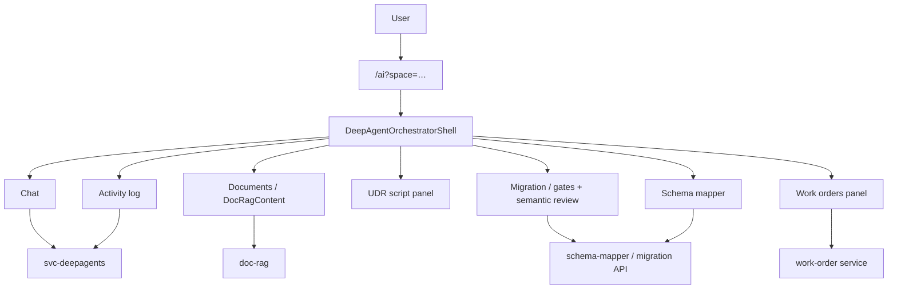

# Single-Door Orchestrator — Implementation Map

**Date:** 2026-05-25  
**Goal:** One chat at `/ai` for migration, live CMMS (Fiix/schema), doc RAG, UDR, and work orders — no competing AI UIs.

---

## End goal checklist

| Requirement | Status |
|-------------|--------|
| `/ai` is the only AI entry (orchestrator shell) | Done |
| Home, login, dashboard → `/ai` | Done |
| WO create → `/ai?space=work_orders` | Done |
| UDR/import → `/ai?space=udr` | Done |
| Center tabs: Chat, Documents, Migration, UDR, Work orders, Schema mapper | Done |
| Doc RAG full UI in center **Documents** tab | Done (`DeepAgentDocumentsPanel` → `DocRagContent`) |
| Migration gates (incl. editable semantic review) in center **Migration** tab | Done (`DeepAgentMigrationPanel` → `MigrationContent` / gates) |
| UDR script + “Edit mappings & gates” opens center Migration | Done |
| Fiix schema mapper in center **Schema mapper** tab | Done (pre-existing) |
| Work orders stats/list in center **Work orders** tab | Done |
| Unified **Activity** log (messages + tools + HITL + approval actions) | Done (`DeepAgentActivityLog`) |
| Saved Spaces LHS + pinned runs | Done (bala1 + `orchestratorHref`) |
| Legacy 4-tab `AiChatClient` removed | Done (file deleted) |
| Operational WO pages (list, detail, inbox, command center) | Kept — linked from WO panel |

---

## Route & navigation

| Route | Behavior |
|-------|----------|
| `/` | → `/ai` |
| `/ai` | Orchestrator shell |
| `/ai?space=documents` | Documents center tab |
| `/ai?space=migration` | Migration center tab |
| `/ai?space=udr` | UDR center tab |
| `/ai?space=work_orders` | Work orders center tab |
| `/ai?space=schema` | Schema mapper center tab (when pipeline active) |
| `/work-orders/new` | → `/ai?space=work_orders` |
| `/import` | → `/ai?space=udr` |
| `/ai/orchestrator` | → `/ai` |
| Login / auth default redirect | → `/ai` |

Helper: `orchestrator-space-params.ts` — `parseOrchestratorSpaceParam`, `orchestratorHref`.

---

## Key files

### New

| File | Purpose |
|------|---------|
| `ai-orchestrator-page-client.tsx` | URL `?space=` → `initialSpace` |
| `orchestrator-space-params.ts` | Deep-link helpers |
| `deep-agent-work-orders-panel.tsx` | WO center/rail panel |
| `deep-agent-documents-panel.tsx` | Doc RAG center panel |
| `deep-agent-activity-log.tsx` | Unified activity timeline + inline gates/approval |

### Modified

| File | Change |
|------|--------|
| `deep-agent-orchestrator-shell.tsx` | All center tabs, Activity rail, approval/HITL in activity log |
| `deep-agent-approval-panel.tsx` | Approve / Reject chain buttons |
| `deep-agent-spaces.ts` | Saved space hrefs → `/ai?space=…` |
| `app-shell.tsx` | Orchestrator nav |
| `page.tsx`, `ai/page.tsx`, redirects | Single door routing |
| `constants/app.ts`, login, auth, dashboard | Default to `/ai` |

### Removed

| File | Reason |
|------|--------|
| `ai-chat-client.tsx` | Superseded by orchestrator shell |

---

## Architecture

Backend reference for Fiix/schema: [`FIIX_ORCHESTRATOR_SCHEMA_MAPPING_FINAL.md`](../apps/backend/cafm-connector-service-final/FIIX_ORCHESTRATOR_SCHEMA_MAPPING_FINAL.md)

---

## Verification

1. Open `/` → lands on `/ai`.
2. LHS **Documents** → Documents tab with upload/query/match.
3. Attach CSV in chat → **Migration** tab with pre-semantic / semantic / field-mapping gates (editable).
4. LHS **Unified Data Register** → UDR tab; **Edit mappings & gates** → Migration tab with full gate UI.
5. Paste Fiix creds in chat → **Schema mapper** tab.
6. LHS **Work orders** → WO panel; **Ask in chat** prefills composer.
7. Right rail **Activity** shows messages, tool calls, HITL gates, approval approve/reject.
8. `/work-orders/new`, `/import`, login → orchestrator.

---

## Intentionally retained

- `/work-orders/list`, `/work-orders/[id]`, command center, email inbox — operational surfaces linked from orchestrator.
- `WoChatWorkOrderDetail` on WO detail page — contextual chat on a specific WO.
- Import wizard code under `features/import/wizard` — still used from ag-grid; `/import` page redirects to orchestrator.
